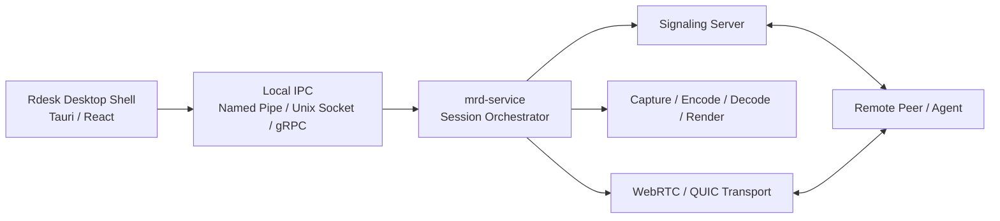

# mrd-service Architecture Migration Design

## Context

`mini-remote-desktop` 当前已经有 `apps/` 与 `crates/` 的 workspace 形态，但主产品入口 [apps/Rdesk/src-tauri/src/main.rs](G:\Project\mini-remote-desktop\apps\Rdesk\src-tauri\src\main.rs) 仍然承担了过多职责：

- UI 命令入口
- 会话信令编排
- QUIC / WebRTC 连接建立
- 渲染状态读取
- 运行时同步

结果是产品壳、应用编排、领域状态、传输适配器混在一层，任何一条新主线都会把整个 Tauri 层一起拖进来。当前 `QUIC mainline session` 的问题本质上就是：会话状态机和传输适配细节没有被从 UI 层切开。

参考仓库 [G:\Project\R-Code](G:\Project\R-Code) 最值得借鉴的不是 crate 数量，而是“产品壳很薄，主逻辑在壳外”的分层方式。

## Goal

把 `Rdesk` 收缩为本机桌面外壳；新增 `mrd-service` 作为本机核心服务，由它负责：

- controller / agent 会话编排
- 与信令服务通讯
- 调用采集、编码、传输、解码、渲染能力
- 维护会话运行态与 telemetry

这样 `Rdesk` 只通过本机 IPC 调用 `mrd-service`，不再直接承担远程桌面主逻辑。

## Target Architecture



## Layering Model

### 1. Product Shell Layer

位置：

- [apps/Rdesk](G:\Project\mini-remote-desktop\apps\Rdesk)

职责：

- UI 页面与窗口管理
- 本机设置、设备列表、会话入口
- 调用本机 IPC client
- 展示 `mrd-service` 的状态快照、日志、telemetry

明确不做：

- 不直接建立 QUIC / WebRTC
- 不直接管理 DXGI / 编码器 / 解码器
- 不直接处理 signaling 消息
- 不直接维护远控会话状态机

### 2. Local Service Layer

新增位置：

- [apps/mrd-service](G:\Project\mini-remote-desktop\apps\mrd-service)

职责：

- 本机服务进程或常驻 runtime
- 装配应用层 use cases
- 维护本机会话 orchestrator
- 对外暴露 IPC API
- 与 `realtime-server` / signaling server 通讯

这是主仓库新的产品主线。

### 3. Application Layer

新增位置：

- [crates/mrd-application](G:\Project\mini-remote-desktop\crates\mrd-application)

职责：

- 把“发起会话 / 接受会话 / 同步运行态 / 启停发送端 / 启停接收端”定义成明确 use cases
- 依赖抽象 port，而不是直接依赖 Quinn、WebRTC、DXGI
- 编排 `session + signal + transport + media + render`

建议的 use cases：

- `start_session`
- `accept_session`
- `sync_runtime`
- `start_sender`
- `start_receiver`
- `stop_session`
- `collect_snapshot`

### 4. Session Domain Layer

收敛位置：

- [crates/mrd-session](G:\Project\mini-remote-desktop\crates\mrd-session)

职责：

- 维护 `SessionId` 对应的领域状态
- 维护 controller / agent 角色
- 维护 transport 选择与 bootstrap 元数据
- 维护 runtime phase（created / listening / connecting / connected / streaming / failed / closed）

这里不直接依赖：

- `quinn`
- `webrtc`
- `tauri`
- `d3d11`

建议收敛出的领域对象：

- `SessionAggregate`
- `SessionRole`
- `TransportKind`
- `SessionBootstrap`
- `SessionRuntimeState`
- `SessionFailure`

### 5. Infrastructure Adapter Layer

保留并收敛现有 crates：

- [crates/mrd-transport-quic-quinn](G:\Project\mini-remote-desktop\crates\mrd-transport-quic-quinn)
- [crates/mrd-transport-webrtc](G:\Project\mini-remote-desktop\crates\mrd-transport-webrtc)
- [crates/mrd-capture-dxgi](G:\Project\mini-remote-desktop\crates\mrd-capture-dxgi)
- [crates/mrd-encode-nvenc](G:\Project\mini-remote-desktop\crates\mrd-encode-nvenc)
- [crates/mrd-encode-openh264](G:\Project\mini-remote-desktop\crates\mrd-encode-openh264)
- [crates/mrd-decode](G:\Project\mini-remote-desktop\crates\mrd-decode)
- [crates/mrd-decode-nvdec](G:\Project\mini-remote-desktop\crates\mrd-decode-nvdec)
- [crates/mrd-render](G:\Project\mini-remote-desktop\crates\mrd-render)
- [crates/mrd-render-d3d11](G:\Project\mini-remote-desktop\crates\mrd-render-d3d11)
- [crates/mrd-signal-client](G:\Project\mini-remote-desktop\crates\mrd-signal-client)
- [crates/mrd-signal-server](G:\Project\mini-remote-desktop\crates\mrd-signal-server)

这些 crate 应该继续存在，但它们只提供能力，不负责编排整个产品流程。

## Repository Layout Target

```text
mini-remote-desktop/
├── apps/
│   ├── Rdesk/                  # 桌面外壳
│   ├── mrd-service/            # 本机核心服务（新主线）
│   ├── realtime-server/        # 信令 / 路由服务
│   └── Rdesk-Server/           # 可选 API 壳
├── crates/
│   ├── mrd-proto/
│   ├── mrd-ipc/                # Rdesk <-> mrd-service 本机协议
│   ├── mrd-session/
│   ├── mrd-application/
│   ├── mrd-media/              # 媒体流水线编排
│   ├── mrd-signal/             # signaling 抽象层
│   ├── mrd-transport/          # transport 抽象层
│   ├── mrd-observability/
│   ├── mrd-signal-proto/
│   ├── mrd-signal-client/
│   ├── mrd-signal-server/
│   ├── mrd-transport-quic-quinn/
│   ├── mrd-transport-webrtc/
│   ├── mrd-capture-dxgi/
│   ├── mrd-encode-nvenc/
│   ├── mrd-encode-openh264/
│   ├── mrd-decode/
│   ├── mrd-decode-nvdec/
│   ├── mrd-render/
│   └── mrd-render-d3d11/
├── tests/
├── docs/
├── tools/
├── subprojects/
└── junk/
```

## Directory Mapping

### `apps/Rdesk/src-tauri`

目标目录：

```text
apps/Rdesk/src-tauri/src/
├── main.rs
├── commands/
├── dto/
└── state/
```

迁移原则：

- `main.rs` 只负责命令注册、状态注入、生命周期装配
- 所有 `realtime_*`, `quic_*`, `webrtc_*` 入口改为调用 IPC client
- 当前直接依赖 `QuicHost`, `WebrtcHost`, `RealtimeRuntime` 的代码应逐步退出 UI 层

### `apps/mrd-service`

目标职责：

- 运行 `mrd-application` use cases
- 提供 IPC server
- 管理 service-level session runtime
- 接收 UI 请求并返回 `SessionRuntimeSnapshot`

### `crates/mrd-session`

应吸收当前：

- [apps/Rdesk/src-tauri/src/quic_session.rs](G:\Project\mini-remote-desktop\apps\Rdesk\src-tauri\src\quic_session.rs)
- 现有部分 `session_lifecycle` / `session_runtime` 中的会话元信息状态

### `crates/mrd-application`

应吸收当前：

- [apps/Rdesk/src-tauri/src/main.rs](G:\Project\mini-remote-desktop\apps\Rdesk\src-tauri\src\main.rs) 中的 `apply_realtime_events_to_session_coordinators`
- `prepare_quic_accept_with`
- `sync_quic_host_from_session_snapshot_with`
- 会话建立与同步相关 orchestration

### `crates/mrd-transport`

作用：

- 定义 `TransportPort`
- 统一 QUIC / WebRTC 的 host/session 生命周期接口

现有 [apps/Rdesk/src-tauri/src/quic_host.rs](G:\Project\mini-remote-desktop\apps\Rdesk\src-tauri\src\quic_host.rs) 中的大部分逻辑应逐步下沉到这里或其适配器 crate。

## IPC Boundary

`Rdesk` 与 `mrd-service` 之间建议使用稳定的本机 IPC 协议，而不是共享内存式直接调用。

建议能力集：

- `register_device`
- `list_devices`
- `start_session`
- `accept_session`
- `start_sender`
- `start_receiver`
- `stop_session`
- `session_runtime_snapshot`
- `stream_probe_events`

传输形式建议优先级：

1. Windows Named Pipe / Unix Domain Socket
2. 本地 loopback HTTP/gRPC
3. Tauri sidecar + stdio protocol

推荐 1，因为它最适合“本机服务 + UI 外壳”模型，也不会额外引入 HTTP 面。

## Migration Principles

### Principle 1: UI First Retreat

先把 `Rdesk` 变薄，而不是先大规模改底层 crate。  
因为当前最严重的问题不是能力缺失，而是编排位置错误。

### Principle 2: Preserve Working Adapters

现有可工作的：

- QUIC Quinn adapter
- WebRTC adapter
- DXGI capture
- NVENC / OpenH264 encoder
- decode / render 路径

都应视为“基础设施能力”，优先复用，不要一上来重写。

### Principle 3: Introduce Ports Before Rewrites

在替换实现之前，先定义：

- signal port
- transport port
- media port
- render port
- ipc contract

先把编排从具体实现上解绑，再考虑换技术。

### Principle 4: Session State Is a Domain Concern

controller / agent、bootstrap、connected、streaming、failed 这些状态属于领域模型，不属于 UI 状态，更不属于单个 transport adapter。

## Major Risks

### Risk 1: 双栈主线长期并存

如果 `Rdesk` 继续保留旧的直接编排逻辑，同时再引入 `mrd-service`，会出现两套主线并行，最终更乱。  
必须明确：`mrd-service` 是新的唯一主线，旧路径只作为迁移兼容层短期存在。

### Risk 2: 过早细拆 crate

当前最需要的是清晰边界，不是 crate 数量。  
不要照搬 `R-Code` 的 crate 粒度；`mini-remote-desktop` 应保持更聚焦的媒体与会话分层。

### Risk 3: IPC 合同不稳定

如果 IPC 请求/响应不断直接跟着内部结构变化，会让 `Rdesk` 与 `mrd-service` 再次强耦合。  
IPC 层必须被当作稳定产品接口来设计。

## Recommended Migration Order

1. 新增 `mrd-ipc`、`mrd-application`、`apps/mrd-service`
2. 从 `apps/Rdesk/src-tauri/src/main.rs` 抽出会话编排 use cases
3. 让 `Rdesk` 改为调用本机 IPC，而不是直接调用 runtime / host
4. 把 `quic_session` 等会话元信息收口到 `mrd-session`
5. 再继续收敛 `quic_host` / `webrtc_host` 到 transport abstraction

## Success Criteria

- `Rdesk` 不再直接拥有 QUIC / WebRTC / signaling 主线逻辑
- `mrd-service` 成为 controller / agent 会话的唯一主入口
- QUIC / WebRTC 只是 transport adapter，不再决定产品架构
- UI 崩溃或重启不会自然等同于会话 orchestration 崩溃
- 会话状态与 transport 状态能通过稳定 IPC snapshot 获取

