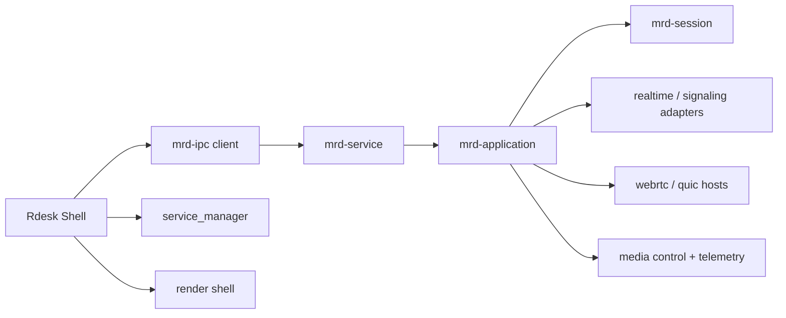

# Rdesk Hard-Cut Service Migration Design

**Date:** 2026-03-20

## Goal

Replace the current dual-mainline desktop architecture with a single-mainline service architecture:

- `apps/Rdesk` becomes a shell-only desktop application.
- `apps/mrd-service` becomes the sole owner of session orchestration, transport runtime, signaling runtime, media control, and runtime snapshots.
- All session-facing desktop commands move to local IPC.
- The old direct in-process control path is deleted in the same cutover, with no fallback path left behind.

## Why This Change

The current repository is in a dangerous transitional state:

- `Rdesk` still owns real session state and transport runtime.
- `mrd-service` exists, but only covers a subset of behavior.
- IPC commands and direct commands coexist.
- State semantics are duplicated across shell and service.

This keeps the codebase in the exact architecture trap the migration was meant to remove:

- multiple truth sources
- duplicated orchestration
- false progress in command migration
- UI process still carrying core remote-desktop behavior

The migration therefore needs to be a hard cut, not an additive transition.

## Non-Goals

This design does not attempt to:

- redesign signaling protocols
- redesign QUIC or WebRTC transport internals
- redesign media encoding pipelines
- introduce HTTP as a primary control plane
- optimize performance beyond what is required to preserve current behavior

The goal is ownership transfer, not feature expansion.

## Target Architecture



## Ownership Rules

After the cutover:

- `Rdesk` must not own session truth.
- `Rdesk` must not instantiate or hold:
  - `RealtimeRuntime`
  - `WebrtcHost`
  - `QuicHost`
  - `WebrtcSessionCoordinator`
  - `QuicSessionCoordinator`
- `mrd-service` becomes the only owner of:
  - session lifecycle
  - signaling/realtime coordination
  - transport host lifecycle
  - sender/receiver lifecycle
  - runtime and probe snapshot generation

The shell may render, display, and request actions, but it may not infer, synthesize, or repair runtime state.

## Application Boundary

### `apps/Rdesk`

Allowed responsibilities:

- Tauri shell boot
- service lifecycle management
- IPC client calls
- UI state and DTO presentation
- render window shell
- local settings and local-only hardware inspection

Forbidden responsibilities:

- starting or accepting sessions directly
- applying signaling events directly
- managing transport hosts directly
- owning session coordinators directly
- composing runtime snapshots from live transport state

### `apps/mrd-service`

Required responsibilities:

- process-local runtime composition
- session orchestration
- signaling event application
- QUIC/WebRTC host control
- sender/receiver control
- runtime snapshot assembly
- probe and telemetry aggregation
- stable IPC serving

## Repository Layout

### Target `Rdesk` layout

```text
apps/Rdesk/src-tauri/src/
├── main.rs
├── ipc_client.rs
├── service_manager.rs
├── commands/
│   ├── service.rs
│   ├── device.rs
│   ├── session.rs
│   ├── telemetry.rs
│   └── render.rs
├── dto/
└── state/
    └── app_state.rs
```

### Target `mrd-service` layout

```text
apps/mrd-service/src/
├── main.rs
├── app_state.rs
├── ipc_server.rs
├── handlers/
│   ├── device.rs
│   ├── session.rs
│   ├── transport.rs
│   └── telemetry.rs
├── adapters/
│   ├── realtime.rs
│   ├── quic.rs
│   ├── webrtc.rs
│   ├── media.rs
│   └── render_probe.rs
└── runtime/
    └── session_runtime.rs
```

## IPC Contract Requirements

The current IPC contract is too small for a hard cut. The shell cannot remain thin unless the service exposes complete control and observation primitives.

### Required request surface

- `RegisterDevice`
- `ListDevices`
- `StartSession`
- `AcceptSession`
- `StartSender`
- `StartReceiver`
- `StopSession`
- `GetSessionSnapshot`
- `ListSessions`
- `GetRuntimeSnapshot`
- `GetProbeSnapshot`
- `ServiceHealth`

### Required response surface

- `DeviceInfo`
- `SessionRuntimeSnapshot`
- `RuntimeSnapshot`
- `ProbeSnapshot`
- `ServiceStatus`
- error DTOs with machine-readable codes

### Snapshot rules

`Rdesk` must display service-owned state without reinterpretation.

`SessionRuntimeSnapshot` must include at minimum:

- `session_id`
- `role`
- `state`
- `transport_kind`
- `local_bootstrap`
- `remote_bootstrap`
- `last_error`

`RuntimeSnapshot` must carry aggregated runtime state rather than forcing the shell to call multiple direct helper paths.

## Cutover Plan

The hard cut must happen as one ownership switch, even if the implementation work happens in stages.

### Pre-cut requirement

Before removing old shell state, `mrd-service` must already support all session control operations needed by the current UI.

### Cutover action

In the cutover commit:

1. switch all session-facing Tauri commands to IPC-only
2. remove old direct command implementations
3. remove runtime/session/host ownership from `Rdesk::AppState`
4. delete direct helper functions that touch transport/session runtimes
5. register only IPC-backed command handlers for session control

### Post-cut invariant

No session control command in `Rdesk` may reach transport or signaling runtime directly.

## State Model Expectations

The current service-side snapshot logic still uses inferred state. That is not sufficient for the target architecture.

The real state model must live below IPC and expose:

- role ownership
- lifecycle stage
- bootstrap status
- transport attachment status
- sender/receiver status
- last failure

`mrd-service` may internally derive some values from lower-level hosts, but the derivation must happen inside the service, not in the shell.

## Error Handling

### Shell

- IPC connection failures are surfaced as shell-visible service errors.
- The shell may trigger service start/restart through `service_manager`.
- The shell must never silently fall back to direct in-process control.

### Service

- Invalid session IDs return stable IPC errors.
- Runtime failures are recorded into service-owned snapshot state.
- Transient transport/signaling failures are reflected in snapshot/probe data.

## Rendering Boundary

Rendering remains the one deliberate exception to “service owns everything”.

Recommended boundary:

- `mrd-service` owns frame-producing runtime state and decode status.
- `Rdesk` owns render windows and UI composition.
- `Rdesk` does not infer session state from renderer internals.

This keeps desktop UX local while preserving a single orchestration owner.

## Testing Strategy

### Required compile/test gates

- `cargo test -p mrd-ipc -p mrd-session -p mrd-application`
- targeted `mrd-service` request/response tests
- targeted `Rdesk` command tests for IPC-backed commands

### Required architectural checks

- `Rdesk` no longer imports or stores:
  - `RealtimeRuntime`
  - `WebrtcHost`
  - `QuicHost`
  - `WebrtcSessionCoordinator`
  - `QuicSessionCoordinator`
- no session command in `Rdesk` bypasses IPC
- `mrd-service` can satisfy minimum controller/agent session flow

### Required integration check

Run a minimal local flow:

1. start `mrd-service`
2. issue session commands from shell through IPC
3. fetch runtime snapshot through IPC
4. verify no direct shell runtime path is required

## Risks

### Main risk

The repository currently mixes product shell responsibilities with runtime responsibilities. Hard cut migration will break fast if the IPC surface is underspecified.

### Mitigation

- make IPC contract complete before deleting shell ownership
- delete old shell state in the same cutover
- verify command-by-command replacement before merge

## Success Criteria

The migration is complete only when all of the following are true:

1. `Rdesk` no longer owns remote-desktop runtime state.
2. `mrd-service` is the only owner of session orchestration.
3. all session control and runtime observation in `Rdesk` are IPC-backed.
4. there is no remaining direct command path for signaling/transport/session control.
5. the minimum controller/agent workflow still runs after deletion of the old shell runtime path.
