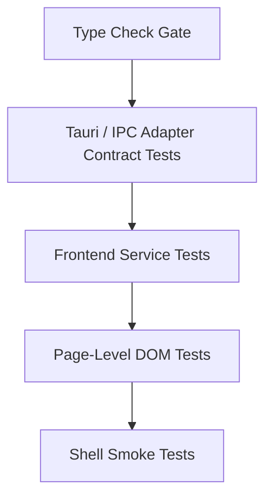

# Rdesk Frontend Testing Architecture Design

**Date:** 2026-03-21

## Goal

Define a frontend testing architecture for `apps/Rdesk` that matches the hard-cut `shell -> local service -> IPC` migration:

- page-level regressions must be caught before runtime
- removed Tauri contracts must not stay green behind stale mocks
- `SettingsModal` and `RemoteSessionPage` must be testable as real pages, not just as service wrappers
- frontend verification must become a hard gate, not a best-effort check

## Why This Needs a Separate Design

The current frontend test gap is no longer a matter of missing one or two assertions.

The repository now shows a structural mismatch:

- `vite build` can pass while page code still contains migration regressions
- service-layer mock tests can stay green while the Tauri command surface has already changed
- page tests have started to appear, but the test infrastructure is not yet stable enough to serve as a real gate
- frontend verification is still fragmented across `vitest`, ad hoc mocks, and partial DOM setup

This means the problem is now test architecture, not test quantity.

## Current State Summary

At the time of this design:

- `apps/Rdesk/package.json` has `test`, `test:watch`, `test:ui`, and `type-check`
- `apps/Rdesk/vite.config.ts` already contains a `test` block using `happy-dom` and `src/test/setup.ts`
- `src/test/setup.ts` and `src/test/utils/test-renderers.tsx` exist, but the page-test base is still incomplete
- page-level tests are beginning to appear, but they are not yet a stable contract gate
- the codebase has already experienced contract drift between:
  - frontend service wrappers
  - Tauri `invoke_handler`
  - page components that still call deprecated or migrated capabilities

This design therefore assumes the repository is already in partial migration, not starting from zero.

## Non-Goals

This design does not attempt to:

- redesign the UI itself
- redesign the IPC protocol
- replace Vitest with another framework
- add browser E2E automation as the primary gate
- fully rewrite every existing frontend test in one pass

The goal is to create a stable layered test strategy that can support the migration already underway.

## Design Principles

1. Page behavior matters more than source shape.
2. Removed backend commands must fail in tests as soon as the frontend still depends on them.
3. Direct `invoke()` usage should be isolated behind a narrow adapter boundary.
4. Route/page tests should validate user-visible behavior, loading, error, and degraded states.
5. Type-check and test discovery must be green before any page test is treated as meaningful.

## Recommended Approach

There are three possible directions:

1. Keep adding more service mock tests.
2. Add page tests without changing the test base.
3. Build a layered frontend verification stack and then migrate the highest-risk pages first.

The recommendation is option 3.

Options 1 and 2 would keep repeating the same failure mode: green tests around a drifting shell contract. The correct move is to turn frontend verification into an explicit stack with clear ownership boundaries.

## Target Testing Layers



### Layer 1: Type Check Gate

This is the first hard stop.

Required outcomes:

- `npm run type-check` must pass
- test files must be part of the same correctness bar as production code
- unresolved symbols, missing imports, and missing test-only dependencies must fail fast

Rationale:

- current migration regressions have already shown that `vite build` is not sufficient
- page tests are meaningless if the project can still ship unresolved page code

### Layer 2: Tauri / IPC Adapter Contract Tests

This layer validates the frontend boundary to the shell.

Scope:

- centralize `invoke()` access behind adapter modules
- test command names, argument shape, and error mapping at the adapter boundary
- reject deprecated command surfaces instead of silently preserving them in mocks

Rationale:

- stale service tests previously kept removed commands green
- contract drift must be caught where it starts, not only when a page happens to render

### Layer 3: Frontend Service Tests

This layer remains useful, but only after the adapter boundary is made explicit.

Scope:

- test state shaping and UI-facing transformation logic
- test loading/error mapping for data returned by IPC adapters
- avoid defining the Tauri contract directly inside service tests

Rules:

- service tests may mock adapters
- service tests must not define raw command names as their own source of truth

### Layer 4: Page-Level Tests

This is the missing layer that now deserves its own architecture.

Scope:

- render real pages/components in a DOM environment
- execute `useEffect` flows
- cover user interactions
- assert visible states:
  - loading
  - success
  - degraded/disabled migration state
  - backend error

This layer must become the main regression net for migration-sensitive UI.

### Layer 5: Shell Smoke Tests

This remains lightweight.

Scope:

- verify the shell still wires together page entrypoints and IPC shell commands
- keep this small; it is not a replacement for page tests

## Required Test Infrastructure

### 1. Stable DOM Test Entry

Keep Vitest as the test runner, but treat the DOM environment as first-class infrastructure:

- one shared `setup` file
- one shared render helper
- one shared Tauri mock strategy
- one shared router wrapper for page tests

The important part is not whether the environment is `happy-dom` or `jsdom`; the important part is to stop each new page test from inventing its own foundation.

Recommendation:

- continue using the existing Vitest integration in `vite.config.ts`
- standardize the DOM setup around one supported environment
- do not mix multiple unofficial test bootstraps per page

### 2. Shared Page Render Base

Create a standard page test renderer for `apps/Rdesk`.

Expected responsibilities:

- route context
- shared app providers
- optional shell-level dependency injection
- stable helper for rendering pages under realistic navigation state

This should replace ad hoc `render()` calls in migration-sensitive page tests.

### 3. Shared Tauri Mock Boundary

The test architecture should expose one canonical way to mock Tauri commands.

Recommended rule:

- page tests do not mock `@tauri-apps/api/tauri` directly in every file
- instead, tests override one adapter-facing boundary

Benefits:

- removes stringly-typed command duplication across tests
- makes it obvious when a command was removed or renamed
- keeps page tests focused on behavior rather than shell internals

### 4. Clear Test-Only Utilities Boundary

Test helpers should not become accidental public runtime surface.

Rules:

- test utilities live under `src/test/`
- test helpers are imported by tests, not by production modules
- no source-string assertions against transformed component modules

This directly closes the current class of brittle tests that mix behavior checks with source-shape checks.

## File Layout Recommendation

Recommended structure inside `apps/Rdesk`:

```text
src/
├── app/
│   ├── components/
│   │   ├── SettingsModal.tsx
│   │   ├── SettingsModal.page.test.tsx
│   │   ├── RemoteSessionPage.tsx
│   │   └── RemoteSessionPage.page.test.tsx
│   ├── services/
│   └── adapters/
│       └── tauri/
├── test/
│   ├── setup.ts
│   ├── mocks/
│   │   └── tauri.ts
│   ├── fixtures/
│   └── utils/
│       ├── render-page.tsx
│       └── route-helpers.ts
```

The key change is ownership:

- `services/` no longer define raw shell command truth
- `adapters/tauri/` owns shell command mapping
- `test/` owns page rendering, fixtures, and Tauri mocks

## First-Rollout Scope

The first rollout should be deliberately narrow.

### Page 1: `SettingsModal`

This page is high-value because it is the visible control surface for service lifecycle and migration-state messaging.

Required scenarios:

- initial load succeeds
- service status refresh succeeds
- service status refresh fails
- deprecated capabilities are shown as unavailable or migrated
- lifecycle buttons map to the supported shell/service commands only
- no test inspects source text or import strings

### Page 2: `RemoteSessionPage`

This page is high-risk because it has historically carried the densest contract drift.

Required scenarios:

- page renders without calling removed direct-session commands
- migrated features are visibly disabled or rerouted through supported adapters
- missing render-window capabilities degrade safely
- page effects do not throw during mount
- critical button flows map only to current supported control paths

## What Must Stop

The new architecture explicitly forbids the following patterns:

- page tests that validate source strings
- service tests that hardcode removed Tauri command names as the expected long-term contract
- page components directly depending on deprecated control surfaces without a visible degraded state
- green test runs that skip type-check as a hard gate

## Migration Strategy

### Phase 1: Stabilize the Base

- make `type-check` pass
- make Vitest discovery stable
- normalize `setup.ts`, render helpers, and Tauri mock strategy

### Phase 2: Lock the Adapter Boundary

- define the supported shell command surface in one adapter layer
- migrate service tests to target adapters instead of raw `invoke()`
- delete tests that only preserve removed command names

### Phase 3: Add First Page Tests

- add `SettingsModal` page tests
- add `RemoteSessionPage` page tests
- cover loading, success, degraded, and error states

### Phase 4: Tighten Gates

- make `type-check` mandatory in frontend verification
- require page-test pass for migration-sensitive UI changes
- treat removed-command regressions as blocking failures

## Success Criteria

This design is considered implemented only when all of the following are true:

- `npm run type-check` is green
- Vitest discovery is green
- page tests exist for `SettingsModal` and `RemoteSessionPage`
- page tests validate behavior, not source strings
- direct removed command contracts are no longer kept green by stale service mocks
- frontend CI/local verification can catch a page calling a removed shell command before runtime

## Risks

### Risk 1: Over-mocking survives under a new name

If the project keeps mocking raw shell calls in every test file, the new structure will look cleaner without actually improving regression coverage.

Mitigation:

- keep one canonical Tauri adapter boundary

### Risk 2: Page tests become too expensive

If every page test tries to behave like full end-to-end automation, the suite will become slow and fragile.

Mitigation:

- keep page tests at the DOM and route level
- reserve shell smoke for a small number of flows

### Risk 3: Type-check remains optional in practice

If developers keep relying on `vite build` or selective test runs, the current class of migration regressions will continue.

Mitigation:

- treat `type-check` as part of the required frontend verification sequence

## Recommended Verification Order

For frontend changes in `apps/Rdesk`, the target local verification sequence should become:

1. `npm run type-check`
2. `npm run test`
3. targeted page tests for changed routes/components
4. optional shell smoke where the change touches IPC shell wiring

## Outcome

This design moves `Rdesk` frontend verification away from fragile service-level mock greens and toward a layered architecture that matches the repository's hard-cut service migration.

The immediate next milestone is not "write more tests." It is:

- stabilize the frontend test base
- define the adapter boundary
- add page-level coverage for the two highest-risk pages

Only after that will the frontend test suite start acting as a real migration gate.
