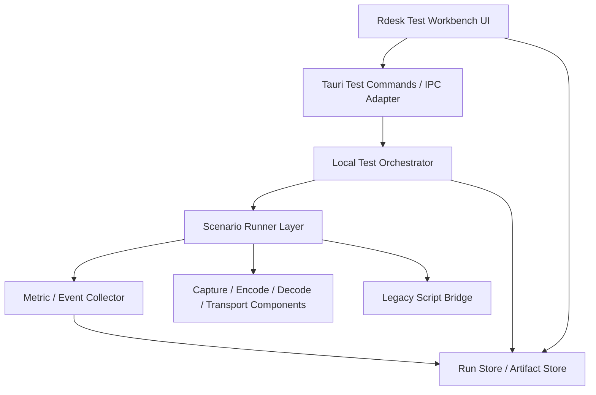

# Rdesk 测试工作台可视化设计

**Date:** 2026-04-19

## Goal

定义一套面向 `apps/Rdesk` 的测试工作台设计，使当前偏单一的“端到端可视化测试页”演进为一个覆盖开发期手测、并可平滑升级为半自动回归台的统一测试平台。

这份设计覆盖四个层面：

- 前端测试工具页的大幅改版与信息架构
- `src-tauri` / 本地服务侧的测试编排模型
- 指标、日志、截图、阶段状态等可视化采集体系
- 支持自由组合与预设矩阵的执行模型

## Why This Needs a Separate Design

当前仓库里的测试工具能力已经出现明显结构性缺口，而不是“页面上再多加几个按钮”就能解决。

从现状看：

- 前端的 [TestPage.tsx](/G:/Project/mini-remote-desktop/apps/Rdesk/src/app/components/TestPage.tsx) 仍然是单页、单链路、单指标面板模型
- Tauri 侧的 [test_harness.rs](/G:/Project/mini-remote-desktop/apps/Rdesk/src-tauri/src/test_harness.rs) 本质上还是“单线程本地流水线演示器”
- 现有 `TestChain` 虽然已经有 `custom` 形态，但执行模型还不是“任务编排”，而是“运行一个当前选中的链路”
- 指标模型 [types.ts](/G:/Project/mini-remote-desktop/apps/Rdesk/src/app/adapters/tauri/types.ts) 只有一组聚合数值，缺少时间序列、阶段拆分、运行配置快照和 artifact 视图

这意味着当前页面适合作为“本地看一眼是否能跑起来”的演示入口，但不足以承担：

- 组件级单测式手测
- 多链路、多参数对比
- 手测结果的结构化归档
- 基于矩阵的批量执行
- 后续半自动回归

因此这次设计必须从“测试工作台”而不是“测试页面”出发。

## Current State Summary

### 前端现状

当前 `/test` 路由挂到 [routes.ts](/G:/Project/mini-remote-desktop/apps/Rdesk/src/app/routes.ts)，页面入口只有一个 `TestPage`。

这个页面的核心特点是：

- 只有一个主视图，没有子界面分类
- 只有一个当前选中的 `TestChain`
- 只有开始/停止两态控制
- 指标展示以单次运行的聚合值为主
- 可视化只覆盖实时画面，尚未覆盖阶段详情、日志、错误定位、历史对比

这对“快速试一下”足够，但对系统性测试不够。

### 后端现状

当前 [test_harness.rs](/G:/Project/mini-remote-desktop/apps/Rdesk/src-tauri/src/test_harness.rs) 具备这些能力：

- 启动本地 capture -> encode -> decode 链路
- 维护当前运行状态
- 返回一份聚合指标
- 返回一帧最新画面

但它还没有这些能力：

- 将不同测试抽象为统一的 `scenario`
- 同时管理多个测试运行记录
- 将运行过程拆为阶段并可视化
- 将失败原因结构化
- 以矩阵方式展开多组参数
- 保存 artifact 和历史结果

### 结论

当前形态更接近“单个测试 harness 的 UI 外壳”，而不是“测试工作台”。

## Non-Goals

这份设计不尝试：

- 重新设计远控主业务流程
- 在第一阶段就把所有测试接入 CI
- 立即实现跨机器分布式测试
- 在第一阶段就做完整数据库化历史系统
- 把已有 PowerShell / Python / component matrix 脚本一次性全部迁移完

这份设计的目标是先建立统一工作台和统一测试模型，让后续演进有稳定骨架。

## Design Principles

1. 测试类型优先于实现细节。
2. 手测可见性优先于“后台黑盒跑完”。
3. 同一种测试无论是单次手动运行还是矩阵批跑，都必须落到统一数据模型。
4. 页面结构必须直接映射测试心智模型，而不是映射底层代码模块。
5. 指标必须同时支持实时观察、单次总结、跨运行对比。
6. 后端编排层必须与具体 capture/encode/decode/transport 实现解耦。
7. 第一阶段优先本机开发手测，但第二阶段可以直接扩展到半自动回归。

## Recommended Approach

推荐采用“测试工作台型”方案。

即：

- 前端将 `/test` 重构为完整工作台，而不是单卡片页面
- 后端引入统一测试编排器 `Test Orchestrator`
- 所有测试都抽象成统一的测试任务、配置、运行记录、指标流和产物集合
- UI 支持分类子界面、自由组合、矩阵批量执行、历史回看

这是唯一能同时满足“开发期手测”与“后续半自动回归”的方案。

## Top-Level Architecture

## Target Product Shape

测试工具页应升级为“测试工作台”，其导航与内容组织不再按“当前链路”展开，而是按“测试意图”展开。

推荐的信息架构如下：

### 1. 总览页

展示测试平台的总状态。

包含：

- 当前环境摘要
- 可用硬件能力
- 最近一次运行结果
- 最近失败项
- 快速入口
- 推荐预设

这个页面服务于“我现在这台机器能测什么”和“下一步先点哪里”。

### 2. 单项测试页

这一组页面对应用户明确提出的分类方式。

建议拆成以下子界面：

- 采集测试
- 编码测试
- 解码测试
- 渲染测试
- 传输测试
- 端到端本地测试

每个子界面只暴露该测试域相关的配置、指标与 artifact。

例如：

- 采集测试页重点展示帧率稳定性、分辨率、采集耗时、丢帧和采集画面
- 编码测试页重点展示码率、编码延迟分位值、关键帧行为、编码失败率
- 端到端本地测试页重点展示各阶段总链路延迟、阶段拆解和首帧时间

### 3. 自由组合页

允许开发者自行选择：

- capture backend
- encoder
- decoder
- renderer
- transport
- resolution / fps / bitrate
- 时长 / warmup / 重复次数

这一页面向高级开发者，用于快速构造“非常规组合”。

### 4. 矩阵测试页

这是从“手测工作台”演进到“半自动回归台”的关键桥梁。

该页面支持：

- 选择一个基础 scenario
- 选择多个维度展开
- 预览矩阵展开结果
- 批量执行
- 按运行结果过滤与排序
- 将失败项一键重跑

矩阵不是独立体系，而是“在统一 scenario 模型上做参数展开”。

### 5. 运行详情页

每次测试运行都应有独立详情页。

详情页应包含：

- 运行配置快照
- 阶段状态时间线
- 指标时间序列
- 聚合指标摘要
- 错误与告警
- artifact 预览
- 环境快照
- 原始日志

### 6. 结果历史页

用于查看最近 N 次运行或按条件过滤。

支持：

- 按测试类型筛选
- 按预设筛选
- 按结果状态筛选
- 按环境能力筛选
- 对比两个运行结果

## Frontend Information Architecture

### 页面布局建议

推荐采用三栏或二段式布局，而不是当前单列控制台布局。

标准布局：

- 左侧：测试分类导航
- 中部：当前测试配置与运行区
- 右侧：实时指标、状态和 artifact 缩略预览

当进入“运行详情”模式时：

- 顶部显示运行摘要和状态 badge
- 中段显示阶段时间线与关键数值
- 下段切换图表、日志、画面、对比

### 视觉层级建议

这套页面的视觉重点不该是“装饰感”，而应是“可读性 + 可扫描性”。

应优先强调：

- 当前测试类型
- 当前运行状态
- 当前瓶颈阶段
- 当前错误归因
- 当前环境与配置

页面中的最强视觉信号应该给：

- 失败状态
- 超阈值指标
- 阶段阻塞
- 配置与环境不兼容

### 关键交互

必须支持：

- 启动 / 停止 / 重跑
- 保存为预设
- 从历史结果复制配置
- 将自由组合转成矩阵
- 将矩阵中的单项下钻到详情页
- 将失败运行再次执行并带上相同配置

## Unified Test Domain Model

测试工作台需要统一的数据模型，而不是让每个测试页自己拼数据。

推荐抽象如下：

### TestScenario

描述“要测什么”。

字段建议：

- `scenario_id`
- `scenario_kind`
- `component_scope`
- `display_name`
- `description`
- `supports_matrix`
- `default_config_schema`

示例：

- `capture.dxgi`
- `encode.nvenc.h264`
- `decode.nvdec.h264`
- `pipeline.local.e2e`
- `transport.quic.loopback`

### TestConfig

描述“怎么测”。

字段建议：

- capture type
- encoder type
- decoder type
- renderer type
- transport kind
- resolution
- fps
- bitrate
- duration
- warmup duration
- repeat count
- input source
- output validation options

### TestRun

描述“一次具体执行”。

字段建议：

- `run_id`
- `scenario_id`
- `run_mode`：manual / batch / matrix / replay
- `status`：queued / preparing / running / completed / failed / cancelled
- `started_at`
- `finished_at`
- `config_snapshot`
- `environment_snapshot`
- `summary`

### TestStage

描述运行过程中的阶段。

建议统一定义阶段枚举：

- prepare
- capability_check
- warmup
- capture
- encode
- decode
- render
- transport
- validate
- summarize

不是所有 scenario 都必须拥有所有阶段，但统一阶段命名有利于对比。

### MetricSeries

描述时间序列数据。

字段建议：

- `metric_name`
- `unit`
- `samples`
- `aggregation`
- `thresholds`

### Artifact

描述运行产物。

建议支持：

- captured frame
- decoded frame
- rendered frame
- encoded bitstream sample
- structured log
- raw stderr/stdout
- summary json
- validation diff

## Backend Test Orchestrator Design

### 为什么要引入编排层

当前 `test_harness` 直接把“配置选择、组件初始化、运行循环、指标更新、画面缓存”都放在一个模块里。

这种写法能跑，但无法自然支持：

- 多类型测试
- 统一生命周期管理
- 批量执行
- 重放
- 历史归档

所以需要引入 `Test Orchestrator`。

### 推荐职责划分

#### Test Orchestrator

负责：

- 接收前端请求
- 创建 `TestRun`
- 调度对应的 `ScenarioRunner`
- 维护运行状态
- 对接事件流与存储

它不负责具体 capture/encode/decode 逻辑。

#### Scenario Runner

每类测试一个 runner，负责具体执行。

例如：

- `CaptureScenarioRunner`
- `EncodeScenarioRunner`
- `DecodeScenarioRunner`
- `LocalPipelineScenarioRunner`
- `TransportLoopbackScenarioRunner`

#### Metric Collector

统一负责收集：

- 阶段耗时
- 周期性实时指标
- 最终摘要
- 错误与告警

#### Artifact Collector

负责保存：

- 周期性截图
- 关键失败帧
- 原始日志
- 配置快照
- 报告文件

#### Run Store

负责记录运行历史。

第一阶段不要求数据库化，但要求数据模型稳定。

推荐第一阶段可落在：

- 内存索引
- 本地 JSON / NDJSON
- 目录化 artifact 存储

后续可演进到 SQLite。

## Execution Modes

测试平台应支持三种执行模式。

### 1. Manual Run

用户在页面上点击一次执行。

特点：

- 低摩擦
- 适合手测
- 可视化最强

### 2. Batch Run

用户选择一组预设按顺序执行。

特点：

- 适合日常冒烟
- 仍然可视化
- 比单次运行更接近回归

### 3. Matrix Run

用户定义参数维度后批量展开执行。

特点：

- 适合对比
- 适合性能摸底
- 是半自动回归的基础

## Matrix Execution Model

### Matrix 不是“脚本列表”

矩阵模型不应继续依赖“每种组合写一份 case 文件”的扩展方式。

正确做法是：

- 先定义一个基础 scenario
- 再定义一组参数维度
- 编排器负责展开组合

示例维度：

- resolution: `720p / 1080p / 1440p`
- fps: `30 / 60 / 120`
- encoder: `nvenc_h264 / openh264`
- decoder: `nvdec / software`

矩阵展开后，每个组合仍然只是一个标准 `TestRun`。

### 维度控制

必须支持：

- 手动勾选维度值
- 展开前预估组合数量
- 设置最大并发
- 设置失败即停 / 全量跑完
- 设置重复次数

### 并发模型

第一阶段推荐默认串行执行。

原因：

- 最容易保证稳定
- 避免 GPU / 编码器 / 显卡上下文争抢
- 更适合当前开发期手测

第二阶段可支持有限并发，但只能针对资源不冲突场景。

### 结果归约

矩阵结果页必须展示：

- 每个组合的状态
- 关键指标
- 失败原因聚类
- 最优 / 最差结果
- 与基线差异

## Metrics Design

### 指标分层

指标不能只有一个扁平对象，应分三层：

#### 实时指标

用于页面持续刷新。

例如：

- capture fps
- encode queue depth
- decode queue depth
- dropped frames
- running latency

#### 阶段摘要指标

用于单次测试总结。

例如：

- first frame latency
- encode p50 / p95 / p99
- decode p50 / p95 / p99
- total p95
- steady-state fps
- dropped frame rate

#### 对比指标

用于历史或矩阵对比。

例如：

- 相对基线偏差
- 同维度最优值
- 阈值越界率
- 失败密度

### 关键指标建议

不同测试类型应有不同主指标。

#### 采集测试

- capture fps
- frame interval jitter
- capture latency
- dropped capture frames
- resolution stability

#### 编码测试

- encode throughput
- encode p50 / p95 / p99
- bitrate drift
- keyframe interval behavior
- encode failure count

#### 解码测试

- decode fps
- decode p50 / p95 / p99
- frames decoded
- frames dropped
- device fallback reason

#### 端到端本地测试

- first frame latency
- capture -> encode -> decode -> render 各阶段耗时
- total p95
- steady-state fps
- dropped frame rate

#### 传输测试

- end-to-end latency
- packet loss
- retransmit / recovery
- bitrate
- frame arrival jitter

### 时间序列可视化

必须支持基础图表，而不只是数字卡片。

建议至少支持：

- FPS 曲线
- 延迟曲线
- 丢帧累计
- 码率曲线
- 阶段时间线

## Artifact and Visualization Design

### 画面可视化

当前只展示一块实时画布是不够的。

未来应支持：

- 原始采集画面
- 编码前缩略图
- 解码后画面
- 渲染输出画面
- 失败帧冻结

### 日志可视化

日志不应只是原始文本滚动区。

建议支持：

- 阶段日志
- 错误日志
- 结构化事件流
- 按时间筛选
- 按级别筛选

### 失败归因

失败运行详情页应明确区分：

- capability mismatch
- initialization failure
- warmup timeout
- runtime instability
- threshold breach
- validation failure

而不是统一显示成“测试失败”。

## Compatibility With Existing Tools

当前仓库已经有：

- `tests/component-matrix`
- `tests/benchmarks`
- PowerShell 执行脚本
- Python transport suite

这套工作台不应忽略它们，而应为它们预留桥接层。

推荐策略：

- 第一阶段：优先原生接入 `src-tauri` 内可直接调用的本地测试能力
- 第二阶段：用 `ScriptScenarioRunner` 包装现有脚本体系
- 第三阶段：逐步把高频脚本能力迁移为原生 scenario

这样可以避免一次性重写所有测试工具。

## Frontend-to-Backend Command Surface

当前前端 Tauri 适配层 [commands.ts](/G:/Project/mini-remote-desktop/apps/Rdesk/src/app/adapters/tauri/commands.ts) 只提供一组 test harness 命令：

- `testHarnessStart`
- `testHarnessStop`
- `testHarnessSetChain`
- `testHarnessGetChain`
- `testHarnessGetMetrics`
- `testHarnessGetFrames`

这套接口不足以支持工作台。

建议演进为：

- `test_list_scenarios`
- `test_get_capabilities`
- `test_start_run`
- `test_stop_run`
- `test_list_runs`
- `test_get_run`
- `test_get_run_metrics`
- `test_get_run_events`
- `test_get_run_artifacts`
- `test_start_matrix_run`
- `test_list_presets`
- `test_save_preset`

现有 harness 命令可以短期兼容，但不应继续作为长期主接口。

## Rollout Strategy

### Phase 1: 工作台骨架

目标：

- 把 `/test` 改造成多子界面工作台
- 引入统一 scenario/run 数据模型
- 保持现有本地 harness 能接入新 UI

此阶段优先解决“页面结构错误”的问题。

### Phase 2: 编排器与历史系统

目标：

- 引入 `Test Orchestrator`
- 引入 run store 与 artifact store
- 引入运行详情页与历史页

此阶段优先解决“后端只有单运行态”的问题。

### Phase 3: 自由组合与矩阵页

目标：

- 支持自定义组合
- 支持矩阵展开预览
- 支持批量运行与失败重试

此阶段优先解决“只能手动点单项测试”的问题。

### Phase 4: 半自动回归演进

目标：

- 支持预设批跑
- 支持阈值校验
- 支持结果基线对比
- 支持桥接现有脚本测试

此阶段才开始真正进入“半自动回归台”。

## Success Criteria

这份设计的落地完成标准应是：

- `/test` 不再是单页单链路面板，而是多子界面的测试工作台
- 用户可以单独进入采集、编码、端到端等子测试页
- 后端存在统一的 `scenario / run / metric / artifact` 模型
- 指标既支持实时显示，也支持单次总结和历史对比
- 自由组合测试不需要临时改代码即可执行
- 矩阵测试可以展开、执行、查看结果和重跑失败项
- 单次手测产物可以沉淀为历史记录
- 未来接入半自动回归不需要推翻当前 UI 与数据模型

## Risks

### 风险 1：UI 先做大改，但后端模型仍旧单一

如果只做前端子页面拆分，而不引入统一编排层，最后只会得到“多个外观不同的单页 harness”。

缓解方式：

- 编排层与 run 模型必须与页面改版同步设计

### 风险 2：矩阵能力过早追求并发

如果一开始就支持高并发矩阵，GPU 与编解码资源冲突会放大不稳定性。

缓解方式：

- 第一阶段矩阵默认串行执行

### 风险 3：指标体系继续只保留聚合值

如果只保留当前 `HarnessMetrics` 风格的摘要对象，工作台会缺乏诊断能力。

缓解方式：

- 必须同时引入时间序列与阶段事件

### 风险 4：历史结果没有稳定存储

如果运行结束后数据即丢失，矩阵与回归价值会大幅下降。

缓解方式：

- 第一阶段就定义稳定的 run store / artifact store 结构

## Outcome

这份设计将测试工具从“单次本地可视化 harness 页面”升级为“面向开发期手测、且可平滑演进为半自动回归台的测试工作台”。

核心变化不是页面样式，而是三层重构：

- 页面从单视图升级为按测试意图分类的工作台
- 后端从单 harness 升级为统一测试编排器
- 结果从瞬时指标升级为可追踪、可对比、可复用的运行资产

下一步不应直接开始零散改 UI，而应先基于这份设计拆出实施计划，明确：

- 工作台页面与路由拆分
- Tauri 命令面重构
- `Test Orchestrator` 的最小骨架
- run store / artifact store 的第一阶段结构
- 与现有 `test_harness` 的兼容迁移路径
