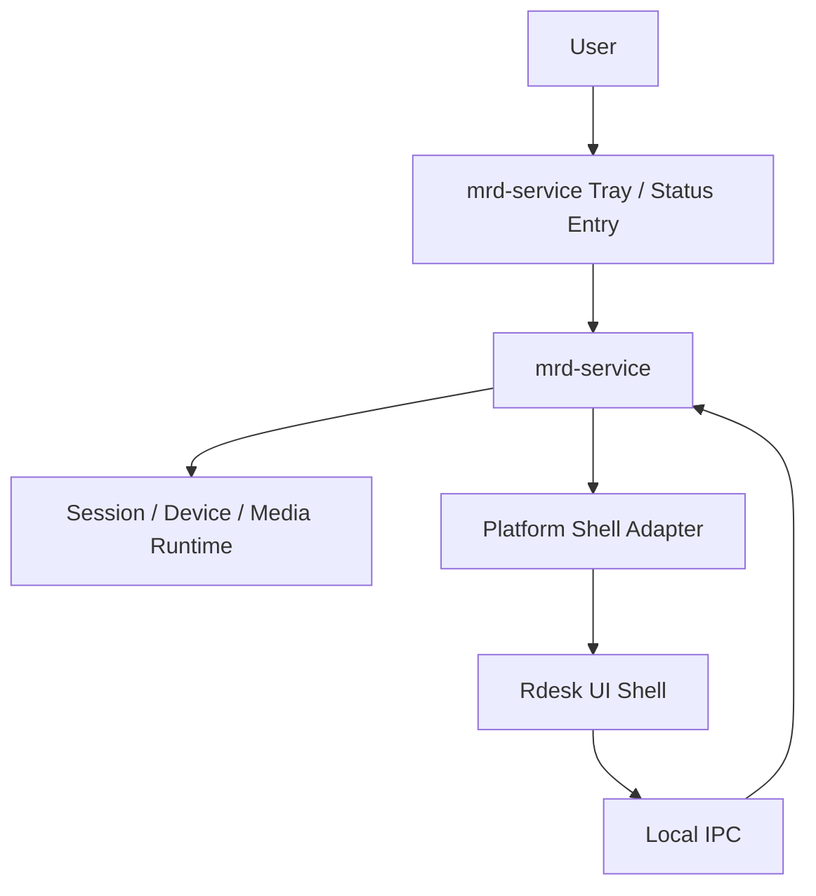
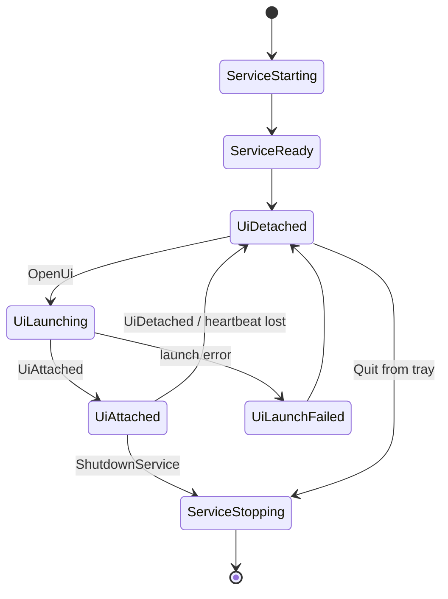

# mrd-service Owned Tray and UI Lifecycle Design

**Date:** 2026-04-20

## Goal

Move long-lived desktop lifecycle ownership from `Rdesk` to `mrd-service`, so `mrd-service` owns the tray, service lifetime, UI launch/focus, and background status while `Rdesk` remains a replaceable UI shell.

This is a cross-platform design. Windows, macOS, and Linux must share the same lifecycle model and IPC contracts, but each platform should use a dedicated shell adapter for tray, autostart, process launch, and window focus.

## Current State

Today `Rdesk` and `mrd-service` are already separate processes:

- `Rdesk` is a Tauri desktop UI process.
- `mrd-service` is a local background orchestration process started by `Rdesk`.
- `Rdesk` currently creates the system tray in `apps/Rdesk/src-tauri/src/main.rs`.
- `Rdesk` currently owns a `ServiceManager` that starts and stops `mrd-service`.
- `mrd-service` is reached through local IPC for device/session operations.

That means process separation exists, but lifecycle ownership is still inverted. The UI starts the service, owns the tray, and may stop the service during UI shutdown. The long-term target should invert this: the service becomes the durable owner, and the UI becomes an attachable console.

## Target Architecture



`mrd-service` becomes the local desktop agent. It owns durable state, session orchestration, tray status, autostart, and UI launch/focus. `Rdesk` becomes a UI console that can be opened, hidden, closed, upgraded, or restarted without tearing down the local agent.

`Rdesk` still keeps one bootstrap responsibility: when launched directly by a user and `mrd-service` is not reachable, it may start `mrd-service` once and wait for IPC health. This is a fallback path, not the primary lifecycle model.

## Design Principles

1. The service owns long-lived state; the UI owns presentation.
2. Closing the UI must not stop remote desktop background capabilities by default.
3. Tray state represents `mrd-service` health, not whether a UI window exists.
4. UI launch must be idempotent: if Rdesk is already running, focus it instead of spawning another copy.
5. Cross-platform behavior should share IPC contracts and state machines, not force one tray implementation across all OSes.
6. Platform-specific shell code belongs behind explicit adapter traits.
7. Failure paths must degrade to a usable state: no tray support should not break service IPC.

## Process Ownership Model

### mrd-service Responsibilities

- Maintain local device/session/media runtime.
- Own system tray or equivalent desktop status entry.
- Expose tray commands:
  - Open Rdesk
  - Show service status
  - Show connected sessions
  - Stop active sessions
  - Restart service
  - Quit service
  - Open logs/diagnostics
- Start or focus Rdesk on demand.
- Track UI presence through IPC.
- Store last known Rdesk executable path and launch metadata.
- Own autostart registration.
- Continue running when Rdesk exits normally.

### Rdesk Responsibilities

- Render desktop UI, settings, test workbench, session controls, diagnostics.
- On startup, connect to `mrd-service`.
- If service is unreachable, try one bootstrap start path and wait for health.
- Register UI presence with `mrd-service`.
- Send `UiDetached` before normal shutdown when possible.
- Ask `mrd-service` to perform service-level actions instead of directly owning them.
- Remove long-term tray ownership after migration is complete.

### Explicit Non-Goals

- Do not make `Rdesk` a mandatory parent process for `mrd-service`.
- Do not stop `mrd-service` on ordinary UI close.
- Do not require a tray implementation for headless Linux/service-only environments.
- Do not force Windows-only mechanisms into the shared domain model.

## Cross-Platform Shell Adapter Model

Add a shell abstraction inside `mrd-service`:

```rust
pub trait TrayPort: Send + Sync {
    fn install(&self, model: TrayModel) -> anyhow::Result<()>;
    fn update(&self, model: TrayModel) -> anyhow::Result<()>;
    fn shutdown(&self) -> anyhow::Result<()>;
}

pub trait UiLauncherPort: Send + Sync {
    fn open_or_focus(&self, request: OpenUiRequest) -> anyhow::Result<OpenUiResult>;
    fn is_ui_running(&self) -> anyhow::Result<bool>;
}

pub trait AutostartPort: Send + Sync {
    fn is_enabled(&self) -> anyhow::Result<bool>;
    fn set_enabled(&self, enabled: bool) -> anyhow::Result<()>;
}
```

The application layer should depend on these ports, not concrete Windows/macOS/Linux APIs.

## Platform Strategy

### Windows

Preferred implementation:

- Tray: Win32 `Shell_NotifyIcon` through a Rust adapter crate or a thin Win32 wrapper.
- IPC: existing named pipe based `mrd-ipc`.
- UI launch: `CreateProcessW` / `std::process::Command` using a stored Rdesk path.
- Focus existing UI: Rdesk registers a local IPC endpoint or single-instance token; service sends `ShowUi`.
- Autostart: registry `HKCU\Software\Microsoft\Windows\CurrentVersion\Run` for user-mode startup, with future option for Windows Service if product requirements demand it.

Windows should be the first fully functional implementation because current capture/encode/decode paths are Windows-heavy.

### macOS

Preferred implementation:

- Tray equivalent: menu bar extra / status item. A Rust adapter can use an Objective-C bridge or a maintained cross-platform tray crate if it exposes native menu bar behavior reliably.
- IPC: Unix domain socket or existing cross-platform local IPC adapter.
- UI launch: `open -a Rdesk.app` or direct app bundle path.
- Focus existing UI: Apple Events / app activation through `open -a`, plus Rdesk-side single-instance IPC.
- Autostart: LaunchAgent or login item registration.

macOS must treat service UI launch as user-session scoped. A background daemon outside the user GUI session cannot reliably show UI without user-session bridging.

### Linux

Preferred implementation:

- Tray: StatusNotifierItem/AppIndicator where available.
- Fallback: no tray, but service remains usable through IPC and Rdesk bootstrap.
- IPC: Unix domain socket.
- UI launch: `.desktop` entry, configured executable path, or direct process spawn.
- Focus existing UI: single-instance IPC to Rdesk is required; window manager focus behavior is not portable.
- Autostart: XDG autostart for desktop sessions; systemd user service for service lifecycle where available.

Linux must support tray absence as a first-class state because GNOME and other desktop environments may not expose legacy tray behavior without extensions.

## IPC Contract Additions

Extend `mrd-ipc` with shell/lifecycle commands:

```rust
pub enum IpcRequest {
    OpenUi { reason: OpenUiReason },
    FocusUi,
    UiAttached { pid: u32, executable_path: Option<String> },
    UiDetached { pid: u32, reason: UiDetachReason },
    GetShellStatus,
    SetAutostart { enabled: bool },
    GetAutostartStatus,
    ShutdownService { mode: ShutdownMode },
}
```

Recommended response types:

```rust
pub enum IpcResponse {
    UiOpenResult { status: UiOpenStatus, pid: Option<u32> },
    ShellStatus { status: ShellStatusSnapshot },
    AutostartStatus { enabled: bool, supported: bool },
    Ack,
    Error { code: String, message: String },
}
```

Key DTOs:

```rust
pub enum OpenUiReason {
    TrayOpen,
    SessionIncoming,
    UserRequest,
    Diagnostics,
}

pub enum UiOpenStatus {
    FocusedExisting,
    SpawnedNew,
    Unavailable,
}

pub struct ShellStatusSnapshot {
    pub service_pid: u32,
    pub ui_pid: Option<u32>,
    pub tray_available: bool,
    pub autostart_enabled: Option<bool>,
    pub active_session_count: usize,
    pub last_error: Option<String>,
}
```

These contracts must live in `crates/mrd-ipc`, not in Tauri-specific frontend adapter types.

## Lifecycle State Machine



Rules:

- `mrd-service` can exist without Rdesk.
- Rdesk can be launched by the user, by tray, or by an incoming event.
- If Rdesk starts and cannot connect to service, it may bootstrap service once.
- If service starts UI and UI fails to attach within a timeout, service records `UiLaunchFailed` and keeps running.
- Service must not infinitely respawn Rdesk after crashes unless an explicit "keep UI open" policy is enabled.

## UI Single-Instance Model

Rdesk must expose a local single-instance endpoint after startup. The endpoint should support:

- `ShowMainWindow`
- `FocusMainWindow`
- `OpenRoute { route }`
- `ShutdownUi`

When `mrd-service` receives `OpenUi`:

1. Check whether UI presence is active.
2. If active, send `ShowMainWindow` through Rdesk single-instance IPC.
3. If not active, launch Rdesk executable.
4. Wait for `UiAttached`.
5. Report `FocusedExisting`, `SpawnedNew`, or `Unavailable`.

This avoids multiple Rdesk windows fighting over the same service connection.

## Path Discovery

`mrd-service` needs a robust way to find Rdesk:

1. Rdesk sends its executable path in `UiAttached`.
2. Service persists the path in a local config file.
3. Installer writes the Rdesk path during installation.
4. Development fallback searches known workspace paths.
5. Final fallback uses `PATH`.

The service must validate that the configured path exists before launch and return a structured error if it does not.

## Tray Menu Model

Initial menu:

- Open Rdesk
- Status: Ready / Starting / Error / Session Active
- Active sessions count
- Diagnostics
- Restart service
- Quit service

Later menu additions:

- Enable/disable autostart
- Copy device ID
- Open logs folder
- Start quick connectivity test
- Pause accepting incoming sessions

The tray menu should be data-driven from `TrayModel`, so platform adapters render the same logical model with platform-specific UI.

## Rdesk Behavior Changes

Rdesk should change from "owner" to "client":

- Startup:
  - Try connect to service.
  - If unreachable, call bootstrap starter.
  - Wait for IPC healthy.
  - Send `UiAttached`.
- Close window:
  - Hide or exit UI only.
  - Do not stop service by default.
- Explicit quit:
  - "Quit UI" only exits Rdesk.
  - "Quit service" sends `ShutdownService`.
- Service controls:
  - Buttons call IPC lifecycle commands.
  - Rdesk should stop using an internal long-lived `ServiceManager` as the primary service owner after Phase 2.

## Failure Handling

### Tray unavailable

Service logs the issue, exposes `tray_available = false`, and continues serving IPC. Rdesk should show a warning in diagnostics but remain usable.

### UI launch failed

Service records last error and keeps running. Tray can show an error state and keep an "Open Rdesk" retry action.

### UI launched but did not attach

Service times out, records `UiLaunchFailed`, and does not keep spawning. Rdesk direct launch remains a fallback.

### Service not reachable from Rdesk

Rdesk may start service once. If health check still fails, Rdesk shows a blocking connection screen with diagnostics and retry.

### Multiple users / desktop sessions

Service should be user-session scoped for tray and UI launch in the first cross-platform implementation. System-level daemon behavior is a later product decision because showing UI from a system service is platform-specific and error-prone.

## Security and Permissions

- `ShutdownService` should only be accepted from local trusted IPC clients.
- Future hardening should authenticate IPC clients or restrict pipe/socket permissions to the current user.
- UI path updates should only be accepted from a running Rdesk process in the same user session.
- Autostart changes must be explicit user actions.
- Tray actions must not expose sensitive session details without opening Rdesk.

## Migration Plan

### Phase 1: Stop coupling ordinary UI exit to service shutdown

Files:

- Modify `apps/Rdesk/src-tauri/src/main.rs`
- Modify `apps/Rdesk/src-tauri/src/service_manager.rs`
- Modify `apps/Rdesk/src/app/adapters/tauri/commands.ts`

Tasks:

1. Change Rdesk close behavior so normal window close hides or exits UI without stopping `mrd-service`.
2. Add explicit command/menu item for "Quit UI and Stop Service".
3. Keep Rdesk tray temporarily, but update labels to make service semantics explicit.
4. Add manual tests for close, hide, quit UI, and stop service.

### Phase 2: Add shell lifecycle IPC contracts

Files:

- Modify `crates/mrd-ipc/src/lib.rs`
- Add `crates/mrd-ipc/tests/shell_lifecycle_contracts.rs`
- Modify `apps/mrd-service/src/main.rs`

Tasks:

1. Add IPC DTOs for `OpenUi`, `UiAttached`, `UiDetached`, `GetShellStatus`, autostart, and shutdown.
2. Write serialization contract tests.
3. Implement no-op handlers in `mrd-service`.
4. Add Rdesk startup registration with `UiAttached`.

### Phase 3: Add UI launcher and single-instance focus

Files:

- Add `apps/mrd-service/src/shell/mod.rs`
- Add platform adapters under `apps/mrd-service/src/shell/windows.rs`, `macos.rs`, `linux.rs`
- Modify `apps/Rdesk/src-tauri/src/main.rs`

Tasks:

1. Add `UiLauncherPort`.
2. Persist last known Rdesk executable path.
3. Add Rdesk single-instance IPC or equivalent focus command.
4. Implement `OpenUi` as focus existing or spawn new.
5. Test duplicate launch behavior.

### Phase 4: Move tray to mrd-service

Files:

- Add `apps/mrd-service/src/tray/mod.rs`
- Add platform tray adapters.
- Modify `apps/Rdesk/src-tauri/src/main.rs`

Tasks:

1. Add `TrayModel`.
2. Implement tray menu actions in `mrd-service`.
3. Wire tray "Open Rdesk" to `OpenUi`.
4. Keep Rdesk tray behind a feature flag for rollback.
5. Validate tray behavior on Windows, macOS, and at least one Linux desktop.

### Phase 5: Move autostart ownership to mrd-service

Files:

- Add `apps/mrd-service/src/autostart/mod.rs`
- Add platform autostart adapters.
- Modify Rdesk settings UI.

Tasks:

1. Add `AutostartPort`.
2. Implement per-platform autostart.
3. Add IPC and UI controls.
4. Add diagnostics for unsupported environments.

### Phase 6: Remove Rdesk service ownership

Files:

- Modify `apps/Rdesk/src-tauri/src/service_manager.rs`
- Modify `apps/Rdesk/src-tauri/src/main.rs`
- Modify `apps/Rdesk/src/app/services/serviceLifecycleService.ts`

Tasks:

1. Reduce Rdesk `ServiceManager` to bootstrap-only behavior.
2. Remove Rdesk tray from default build.
3. Move service lifecycle UI actions to IPC calls.
4. Update docs and tests.

## Testing Strategy

### Contract Tests

- `cargo test -p mrd-ipc shell_lifecycle`
- Verify serialization of shell lifecycle commands.
- Verify unknown/unsupported commands produce structured errors.

### Service Tests

- Start service without Rdesk.
- Call `GetShellStatus`.
- Call `OpenUi` with no configured Rdesk path and verify structured failure.
- Register `UiAttached` and `UiDetached`.
- Verify no infinite relaunch loop.

### Rdesk Tests

- Launch Rdesk when service is running.
- Launch Rdesk when service is absent and verify bootstrap.
- Close Rdesk and verify service stays alive.
- Explicitly stop service and verify Rdesk detects disconnection.

### Cross-Platform Manual Matrix

Windows:

- Tray visible after service start.
- Open Rdesk from tray.
- Focus existing Rdesk from tray.
- Quit UI leaves service alive.
- Quit service removes tray.
- Login autostart works for current user.

macOS:

- Menu bar item appears for user-session service.
- Open/focus Rdesk app bundle.
- Login item or LaunchAgent starts service.
- Service handles UI absence without crash.

Linux:

- AppIndicator/StatusNotifier tray appears where supported.
- No-tray fallback still allows Rdesk bootstrap and IPC.
- XDG autostart or systemd user mode starts service.
- Focus existing UI works through Rdesk single-instance IPC rather than window-manager assumptions.

## Rollback Plan

Keep Rdesk tray behind a feature flag until `mrd-service` tray is validated. If service tray fails on a platform:

1. Disable service tray adapter for that platform.
2. Keep service IPC and UI bootstrap behavior.
3. Re-enable Rdesk tray compatibility layer for that platform.
4. Preserve user-facing ability to open settings and stop service.

## Open Questions

- Should `mrd-service` eventually run as a system service on Windows, or remain a user-session background agent?
- Which cross-platform tray crate is acceptable after evaluating native behavior and maintenance status?
- Should Rdesk single-instance IPC reuse `mrd-ipc`, or use a smaller UI-only local socket/pipe?
- Should service config store executable paths in a repo-specific config file or OS-native application data location?

## Recommended First Implementation Slice

Start with Phase 1 and Phase 2 only:

1. Stop tying ordinary Rdesk close to `mrd-service` shutdown.
2. Add IPC shell lifecycle contracts.
3. Add Rdesk `UiAttached` / `UiDetached`.
4. Add `GetShellStatus`.

This creates the ownership boundary without immediately taking on native tray complexity. Once this boundary is stable, platform tray adapters can be implemented independently.
