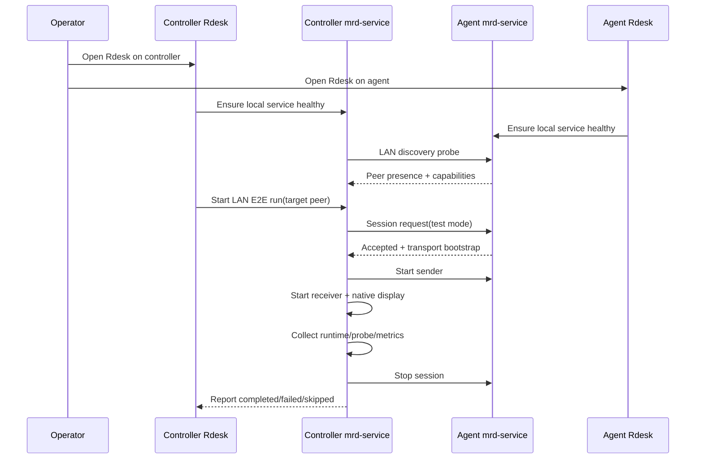

# LAN 端到端自动化测试流程设计

**Date:** 2026-05-02

## Goal

设计一套面向局域网双机的端到端自动化测试流程。测试前提是操作者会在同一局域网内的两台机器上打开相同版本的 Rdesk / mrd-service；系统负责自动发现对端、建立会话、启动远程显示链路、采集指标、判断结果并导出报告。

这套流程优先服务开发期手测，但数据模型和执行边界必须能演进为半自动回归台。

## Scope

第一阶段只覆盖“人工启动软件 + 自动执行测试”的模式：

- 两台机器都已打开 Rdesk，且 mrd-service 可用。
- 控制端从测试工作台发起 LAN E2E run。
- 被控端不需要人工点选复杂操作，默认允许测试模式下的自动接受或明确的一键确认。
- 所有指标、错误、截图、探针事件都回收到控制端报告。

暂不要求：

- 自动远程安装或启动软件。
- 跨公网/NAT 的完整自动化。
- CI 无人值守跨机器调度。
- 真实用户账号体系和云端设备注册依赖。

## Roles

### Controller

控制端机器，负责：

- 选择目标设备和测试矩阵。
- 通过 LAN discovery 找到 agent。
- 发起会话、启动 sender/receiver、打开原生显示窗口。
- 汇总 runtime snapshot、probe snapshot、test metrics、artifact。
- 生成最终报告。

### Agent

被控端机器，负责：

- 广播 LAN presence。
- 接收测试会话请求。
- 在测试模式下自动或半自动接受连接。
- 启动 capture / encode / transport sender。
- 回传健康状态、会话状态、pipeline probe。

### Operator

人工操作者，只负责：

- 确保两端在同一局域网。
- 打开两端软件。
- 在控制端点击“开始 LAN E2E 自动化测试”。
- 必要时在被控端确认测试授权。

## Recommended Flow

推荐采用“手动启动、自动编排”的流程。



## Test Stages

### Stage 0: Preflight

控制端执行：

- `service_wait_for_healthy`
- `ipc_runtime_snapshot`
- `ipc_refresh_lan_discovery`
- `test_get_capabilities`

被控端通过 presence 暴露：

- device id / device name
- service version
- OS
- capture / encoder / decoder / renderer capability
- testing mode status

失败标准：

- 本地 service 不可用：`failed`
- 未发现 peer：`failed`
- peer capability 不满足当前场景：`skipped`

### Stage 1: Pairing And Readiness

控制端选择一个 LAN peer 后创建 run：

- 固定 run id。
- 固定 controller device id 和 agent device id。
- 固定 scenario id，例如 `lan.e2e.remote_display`。
- 固定 config snapshot。

被控端必须进入 readiness 状态：

- `agent_visible=true`
- `test_mode_enabled=true` 或 `manual_accept_pending=true`
- `capture_available=true`
- `transport_available=true`

失败标准：

- 被控端拒绝授权：`failed`
- readiness 超时：`failed`
- capability 不支持：`skipped`

### Stage 2: Session Bring-Up

控制端通过 mrd-service 发起：

- `ipc_start_lan_remote_session`
- `ipc_accept_session` 或等待 agent auto-accept
- `ipc_start_sender`
- `ipc_start_receiver`
- `open_remote_display_window`

验收点：

- controller session state 进入 `streaming` 或等价 active 状态。
- receiver active。
- native display window 已打开。
- probe 中出现 remote frames。

关键要求：

- 禁止用本机 test harness frame 伪装远程画面。
- session id 必须贯穿 runtime snapshot、probe snapshot 和 display window context。
- 如果 native display 创建失败，run 失败，不降级为“看起来成功”。

### Stage 3: Runtime Sampling

测试运行期间每 500ms 采样：

- controller runtime snapshot
- agent runtime snapshot
- probe snapshot
- frames received / decoded / dropped
- current fps
- bitrate
- encode / transport / decode / render latency
- last error
- display window renderer state

最短运行时间建议：

- smoke：10 秒
- interactive：30 秒
- regression：60 秒

### Stage 4: Assertions

MVP 断言：

- run 未进入 failed。
- receiver active。
- frames_received > 0。
- frames_decoded > 0。
- current_fps > 1。
- dropped frame ratio 不超过阈值。
- probe source 标识为 remote session，而不是 local harness。

增强断言：

- 首帧时间小于 5 秒。
- 10 秒窗口内无连续 3 秒零帧。
- 平均 fps 达到目标 fps 的 40% 以上。
- native display renderer uploaded/presented frame count 增长。
- stop 后两端 session 都进入 closed。

## UI Design

在 `/test/e2e` 增加 LAN E2E 卡片：

- 目标设备：来自 LAN discovery peer list。
- 对端状态：online / service healthy / test mode / capabilities。
- 测试方案：remote display smoke、capture encode transport smoke、full display regression。
- 运行时面板：阶段进度、双方状态、实时 fps、首帧耗时、错误原因。
- 结果面板：completed / failed / skipped，附带报告导出按钮。

按钮行为：

- `刷新设备`：触发深度 LAN discovery。
- `检查对端`：只做 preflight，不启动会话。
- `开始 E2E`：自动执行 Stage 0 到 Stage 4。
- `停止`：同时 stop controller 和 agent session。

## Backend Design

### New Scenario

新增统一场景：

- `lan.e2e.remote_display`
- `lan.e2e.capture_transport`
- `lan.e2e.full_pipeline`

### Run Model

run record 需要包含：

- run id
- controller device id
- agent device id
- scenario id
- config snapshot
- controller environment snapshot
- agent environment snapshot
- stage events
- metric series
- artifacts
- final summary

### IPC Commands

第一阶段可以复用现有命令组合，不急于新增大命令：

- `ipc_refresh_lan_discovery`
- `ipc_start_lan_remote_session`
- `ipc_session_snapshot`
- `ipc_probe_snapshot`
- `ipc_start_sender`
- `ipc_start_receiver`
- `open_remote_display_window`
- `test_get_run_metrics`
- `test_get_run_artifacts`

后续可收敛为：

- `lan_e2e_start_run`
- `lan_e2e_get_run`
- `lan_e2e_stop_run`
- `lan_e2e_export_report`

### Agent Control

被控端需要一个测试模式开关：

- 默认关闭，避免安全风险。
- 开启后允许局域网内指定 controller 发起自动测试。
- 可设置一次性 token 或短期 pairing code。
- 测试结束后自动关闭或保持本次会话授权。

## Artifacts

每次 run 生成：

- `summary.json`
- `timeline.json`
- `metrics.csv`
- `controller.log`
- `agent.log`
- `first-frame.png`
- `last-frame.png`
- `failure.txt`

报告目录建议：

```text
artifacts/lan-e2e/<yyyyMMdd-HHmmss>-<run_id>/
```

## Failure Taxonomy

失败原因要结构化：

- `service_unhealthy`
- `peer_not_found`
- `peer_not_ready`
- `permission_denied`
- `session_start_failed`
- `sender_start_failed`
- `receiver_start_failed`
- `display_window_failed`
- `no_remote_frames`
- `fps_below_threshold`
- `runtime_error`
- `stop_failed`

## Implementation Phases

### Phase 1: Manual-Assisted Smoke

- UI 增加 LAN E2E 入口。
- 控制端自动执行 preflight、start session、start receiver、open display、采样、stop。
- 被控端允许手动确认。
- 生成内存态报告。

### Phase 2: Test Mode Auto-Accept

- mrd-service 增加测试模式。
- agent 可自动接受来自已授权 controller 的 LAN E2E request。
- report 写入本地 artifact 目录。

### Phase 3: Matrix Regression

- 把 capture / encoder / decoder / transport / renderer 维度接入 LAN E2E。
- 支持按能力自动 skip。
- 支持批量运行和历史对比。

### Phase 4: Semi-Automated Regression Bench

- 两端打开软件后，控制端可一键跑完整 smoke suite。
- 支持导出 zip 报告。
- 支持失败后保留双方日志和最后帧。
- 可接入 CI 的人工准备型测试节点。

## Acceptance Criteria

第一阶段完成标准：

- 两台局域网机器打开 Rdesk 后，控制端能发现 agent。
- 控制端能一键启动 `lan.e2e.remote_display`。
- 远程显示窗口显示的是对端画面，不是本机画面。
- run detail 显示阶段、fps、frame counters、错误原因。
- 测试结束后两端 session 可关闭。
- agent 未授权或未开启测试模式时，控制端显示明确失败。

## Open Questions

- 测试模式授权默认使用一次性 pairing code，还是本机设置里的固定 allowlist？
- 首阶段是否只支持 Windows-Windows，还是同时允许 macOS/Linux 作为 agent 的 capability skipped 路径？
- 是否需要在 UI 上显示 agent 端弹窗确认，还是完全通过设置页启用测试模式？
