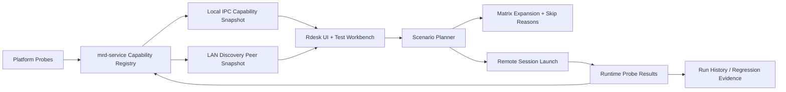

# Capability Matrix Design

## Goal

Build a product-grade capability matrix for mini-remote-desktop that can answer three questions reliably:

- What can this machine do right now?
- Which combinations can actually run, and why are others blocked?
- Which remote peer can satisfy a requested session profile such as 2K 144 FPS?

The matrix must serve both product UI and automation. It should drive `/test`, LAN E2E, remote display launch, peer readiness checks, and future semi-automatic regression runs.

## Current State

The project already has a basic capability surface:

- Rdesk exposes environment arrays such as `available_captures`, `available_encoders`, `available_decoders`, `available_renderers`, and `available_memory_modes`.
- Test Workbench pages use those arrays to disable unsupported local choices.
- mrd-service LAN discovery advertises string capabilities such as `quic_datagram_2k144` and `media_profile_control_v1`.
- LAN E2E now verifies remote capture source selection and QUIC 2K/144 probe profile matching.

The gap is that the current model cannot explain availability. A string such as `nvenc_h264` does not distinguish:

- platform unsupported
- driver missing
- hardware unsupported
- permission missing
- implemented but currently unhealthy
- available but incompatible with the selected memory path
- available but below the requested performance profile

## External Reference Pattern

Mature remote desktop and streaming projects generally split capability into multiple layers:

- Product support matrix: RustDesk and AnyDesk present OS-level support, platform limits, and partial support states.
- Host/client streaming matrix: Sunshine and Moonlight separate host encoding capability from client decoding/display capability, then describe target quality profiles such as high refresh-rate streaming.
- Runtime telemetry: WebRTC does not rely only on static capability; it validates data-plane health through stats such as decoded frames, jitter, freeze count, and round trip time.

For this repo, the correct direction is to combine all three: static OS/hardware capability, runtime probe result, and measured profile validation.

References:

- RustDesk docs: <https://rustdesk.com/docs/en/>
- Sunshine docs: <https://docs.lizardbyte.dev/projects/sunshine/>
- Moonlight: <https://moonlight-stream.org/>
- AnyDesk supported OS: <https://support.anydesk.com/docs/supported-operating-systems>
- W3C WebRTC Stats: <https://www.w3.org/TR/webrtc-stats/>

## Design Principles

1. Capabilities must be structured, not string-only.
2. Every unavailable capability must carry a reason.
3. Matrix filtering must happen before a run starts.
4. Runtime validation must be able to contradict static claims.
5. Remote peer readiness must use the same capability model as local tests.
6. Windows remains the first fully validated platform, while macOS/Linux should report clear partial support states.

## 1. Capability State Semantics

Introduce a structured capability item model.

```ts
type CapabilityStatus =
  | "supported"
  | "available"
  | "usable"
  | "degraded"
  | "permission_missing"
  | "driver_missing"
  | "hardware_missing"
  | "unimplemented"
  | "unsupported"
  | "unknown";

interface CapabilityItem {
  id: string;
  domain: CapabilityDomain;
  label: string;
  status: CapabilityStatus;
  platform: "windows" | "macos" | "linux" | "android" | "ios" | "web" | "unknown";
  reason?: string;
  detail?: string;
  requires?: CapabilityRequirement[];
  conflicts_with?: string[];
  depends_on?: string[];
  fallback_ids?: string[];
  last_probe_time_ms?: number;
}
```

Status semantics:

- `supported`: product code exists for this platform, but runtime has not proven it is usable.
- `available`: runtime probe found required APIs, drivers, or permissions.
- `usable`: a lightweight validation path succeeded.
- `degraded`: usable but below preferred path, for example software encode fallback.
- `permission_missing`: blocked by OS permission such as macOS screen recording.
- `driver_missing`: driver/runtime DLL or library missing.
- `hardware_missing`: GPU or hardware feature absent.
- `unimplemented`: concept exists in the matrix, but no product runner is wired.
- `unsupported`: explicitly not supported on this OS or product mode.
- `unknown`: not yet probed.

This distinction matters because `unsupported`, `unimplemented`, and `driver_missing` lead to different UI and test behavior.

## 2. Combination Constraints

Add a compatibility layer over individual capabilities. A capability being usable alone does not mean the full pipeline is valid.

Example constraints:

- `openh264` requires CPU-backed input, so it conflicts with zero-copy `d3d11_shared` capture unless a copy step is inserted.
- `nvenc_h264` should prefer `d3d11_shared` on Windows and degrade to CPU input only when the backend supports it.
- `d3d12_native` render probe is not the same as a mainline remote display renderer until the backend supports it.
- `webview` rendering is visual fallback and diagnostics only, not native renderer parity.
- `display_shared` capture should be preferred over copy capture for full desktop LAN E2E when available.

Represent constraints separately from capability items:

```ts
interface CapabilityConstraint {
  id: string;
  applies_to: string[];
  status: "allow" | "block" | "degrade" | "requires_copy" | "requires_probe";
  reason: string;
  fallback_ids?: string[];
}
```

Matrix expansion should evaluate constraints before starting a run. Invalid rows should become `skipped` with reason, not `running` or `failed`.

## 3. Platform Dimensions

The matrix should cover product capability domains, not only media primitives.

Recommended domains:

- `capture`: DXGI, WinRT/WGC, ScreenCaptureKit, PipeWire, X11, synthetic, window capture, display capture.
- `capture_source`: display, shared display, single window, region, cursor inclusion.
- `encode`: NVENC H264/HEVC/AV1, VideoToolbox, VAAPI, OpenH264/software.
- `decode`: NVDEC, VideoToolbox, VAAPI, software.
- `render`: D3D11, D3D12 probe, Metal, OpenGL, Vulkan/wgpu, WebView fallback.
- `memory`: CPU, D3D11 shared, DMA-BUF, IOSurface, Metal texture.
- `transport`: QUIC datagram, WebRTC RTP, TCP fallback, signaling channel.
- `control`: keyboard, mouse, gamepad, clipboard, file transfer.
- `audio`: capture, encode, transport, playback.
- `service`: tray, autostart, IPC, UI launch/focus, background session support.
- `security`: pairing, permissions, encryption, consent/accept mode.

Initial platform target:

| Domain | Windows | macOS | Linux |
| --- | --- | --- | --- |
| Capture | DXGI, WinRT/WGC, window/display | ScreenCaptureKit planned | PipeWire/X11 planned |
| Encode | NVENC, OpenH264 | VideoToolbox planned, OpenH264 | VAAPI/NVENC planned, OpenH264 |
| Decode | NVDEC, software | VideoToolbox planned, software | VAAPI/NVDEC planned, software |
| Render | D3D11, D3D12 probe, OpenGL probe, WebView fallback | Metal planned, WebView fallback | OpenGL/Vulkan planned, WebView fallback |
| Memory | CPU, D3D11 shared | CPU, IOSurface planned | CPU, DMA-BUF planned |
| Transport | QUIC datagram, WebRTC | QUIC/WebRTC interface | QUIC/WebRTC interface |
| Control | SendInput first | CGEvent planned | uinput/ydotool/portal planned |
| Service | user-session tray/autostart | menu bar extra planned | tray optional/no-op supported |

The matrix should make partial support explicit. For example, Linux Wayland capture may be `supported` through PipeWire only when portal permission exists; X11 may be available but lower security.

## 4. Performance Profiles

Add first-class performance profiles. A machine can support a component but fail a target profile.

Initial profiles:

- `smoke.720p30`
- `interactive.1080p60`
- `lan.2k144`
- `quality.4k60`
- `diagnostic.software`

Profile model:

```ts
interface CapabilityProfile {
  id: string;
  width: number;
  height: number;
  fps: number;
  bitrate_mbps: number;
  codec: "h264" | "hevc" | "av1";
  latency_budget_ms?: number;
  min_stable_fps_ratio?: number;
  max_drop_ratio?: number;
  required_capabilities: string[];
}
```

Static support should only answer whether a profile is theoretically possible. A measured profile result must answer whether it actually works:

```ts
interface ProfileProbeResult {
  profile_id: string;
  status: "passed" | "failed" | "degraded" | "skipped";
  first_frame_ms?: number;
  stable_fps?: number;
  perceived_latency_p95_ms?: number;
  source_wait_p95_ms?: number;
  encode_p95_ms?: number;
  decode_p95_ms?: number;
  render_p95_ms?: number;
  drop_ratio?: number;
  error?: string;
}
```

This lets `/test` distinguish “NVENC exists” from “2K144 is stable enough”.

## 5. Peer Capability Negotiation

LAN discovery should evolve from string transports to a structured peer capability snapshot.

Current string capabilities such as `quic_datagram_2k144` should remain during migration, but new clients should prefer structured data:

```ts
interface PeerCapabilitySnapshot {
  schema_version: 1;
  device_id: string;
  service_version: string;
  os: PlatformInfo;
  capabilities: CapabilityItem[];
  constraints: CapabilityConstraint[];
  profiles: CapabilityProfile[];
  recent_profile_results?: ProfileProbeResult[];
  permission_summary: PermissionSummary;
  updated_at_ms: number;
}
```

Controller flow:

1. Discover peers.
2. Read structured peer capability snapshot.
3. Evaluate requested scenario and profile locally.
4. If compatible, start session.
5. During session, validate runtime probe against the requested profile.
6. If runtime contradicts static capability, mark the run failed or degraded and persist the result.

This should power:

- LAN E2E auto target selection.
- Remote display launch guardrails.
- `/test` matrix skip reasons.
- Future regression history and profile trend tracking.

## Data Flow



## API Shape

Add new IPC commands while keeping old arrays for compatibility:

- `capability_get_snapshot() -> CapabilitySnapshot`
- `capability_probe(domain?: string) -> CapabilitySnapshot`
- `capability_evaluate_scenario(request) -> CapabilityEvaluation`
- `capability_evaluate_peer(peer_id, request) -> CapabilityEvaluation`

Rdesk should continue to support `test_get_capabilities` initially, but it should be backed by `capability_get_snapshot` once the new model exists.

## UI Behavior

Test Workbench should show:

- capability cards grouped by domain
- status badges with reason
- permission repair hints
- profile readiness such as `1080p60 ready`, `2K144 degraded`, `4K60 unsupported`
- matrix rows marked `ready`, `skipped`, `degraded`, or `blocked`
- peer readiness panel for LAN E2E

Important rule: UI must not allow a manually triggered invalid chain unless the user explicitly enables a diagnostic override. Normal product buttons should fail before launch with a clear reason.

## Error Handling

Capability failures should be deterministic:

- Missing permission: `permission_missing`, with platform-specific recovery text.
- Missing driver/runtime: `driver_missing`, with exact missing library or feature.
- Unsupported OS: `unsupported`, no retry loop.
- Not yet implemented: `unimplemented`, hidden from normal launch paths but visible in diagnostics.
- Runtime failure after static success: `failed`, with stage-specific probe details.

## Testing Strategy

Unit tests:

- status classification
- constraint evaluation
- profile matching
- peer capability evaluation
- legacy string capability fallback

Component tests:

- unavailable choices are disabled with reason
- matrix rows skip invalid combinations
- peer readiness panel shows missing capabilities
- permission missing state shows repair guidance

Integration tests:

- Windows capability snapshot contains capture/encode/decode/render/memory domains.
- LAN E2E rejects peers missing structured 2K144 profile support.
- Runtime profile mismatch fails the run.
- Old `test_get_capabilities` still returns legacy arrays during migration.

Manual matrix:

- Windows NVIDIA host: DXGI/WinRT + NVENC + NVDEC + D3D11 + QUIC 2K144.
- Windows software fallback: WinRT/synthetic + OpenH264 + software decode + WebView/D3D11.
- macOS: explicit partial support and permission states.
- Linux: explicit no-op/partial states for tray, capture, and render until implemented.

## Rollout Plan

Phase 1: Model and compatibility layer.

- Add shared TypeScript/Rust schema.
- Build `CapabilitySnapshot` from existing environment arrays.
- Add constraint evaluator.
- Keep legacy commands stable.

Phase 2: Windows probes.

- Populate Windows capture, encode, decode, render, memory, transport, service, and control domains.
- Add reason strings for driver/hardware/permission failures.
- Attach 1080p60 and 2K144 profile support.

Phase 3: LAN peer negotiation.

- Add structured snapshot to LAN discovery.
- Keep existing string transports as fallback.
- Update LAN E2E to prefer structured peer capability.

Phase 4: UI and matrix behavior.

- Replace string-only filtering in Test Workbench.
- Add profile readiness and skip reasons.
- Add peer readiness panel.

Phase 5: macOS/Linux partial matrix.

- Report explicit `unimplemented`, `permission_missing`, and `unsupported` states.
- Avoid pretending cross-platform capability is ready before runners exist.

## Non-Goals

- Do not implement every platform backend in this design phase.
- Do not remove legacy capability arrays immediately.
- Do not make 2K144 a hard pass threshold for all machines.
- Do not hide unsupported diagnostics from developers; hide them only from normal product launch paths.

## Success Criteria

- `/test` can explain why each option is enabled, disabled, skipped, or degraded.
- LAN E2E can select a peer based on structured capabilities, not only string transports.
- A 2K144 request can be evaluated before launch and verified after runtime sampling.
- macOS/Linux report honest partial states instead of silent fallback.
- Invalid combinations never enter indefinite `running` state.
