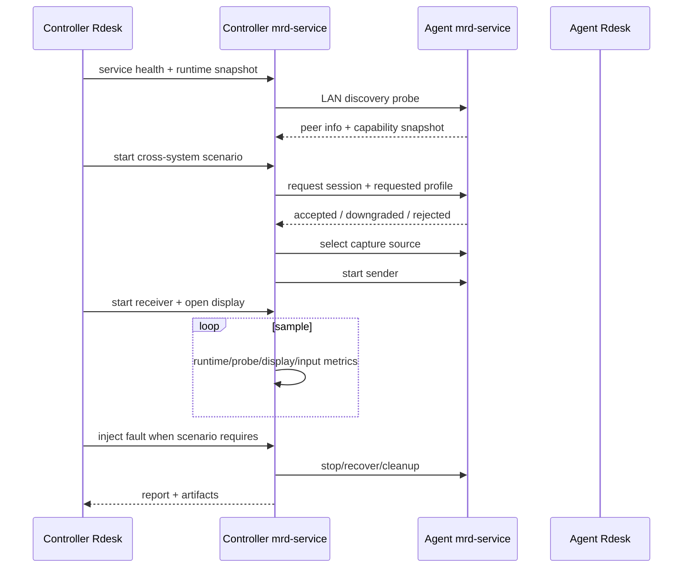

# 跨系统端到端与断链测试设计

**Date:** 2026-05-11

## Goal

设计一套覆盖 Windows、macOS、Linux 的跨系统端到端测试与断链故障测试流程。目标是在两端或多端已启动 Rdesk / mrd-service 的前提下，控制端可以一键验证发现、能力协商、采集、编码、传输、解码、渲染、输入控制、恢复和清理。

本文把“跨系统断测”定义为两类测试：

- 跨系统端到端测试：不同 OS 组合之间能否建立真实远程桌面链路并持续出帧。
- 断链故障测试：在会话中主动制造网络、进程、能力或渲染故障，验证状态机、恢复和错误报告。

## Executable MVP

当前实现先落在 Rdesk `/test/e2e` 的 LAN E2E 自动化区，复用现有 mrd-service IPC，不新增未注册的 Tauri command。

已可执行场景：

- `cross.e2e.discovery`：启动或检查本机 mrd-service，读取 runtime snapshot，注册本机设备，刷新 LAN discovery，找到目标 peer 后结束。该场景不启动 session、不选择 capture source、不打开远程显示窗口，适合先确认两台机器互相可见。
- `cross.e2e.remote_display_smoke`：默认 UI 场景。执行 discovery、启动 LAN remote session、选择远端 capture source、启动 receiver、打开远程显示窗口，并通过 runtime/probe snapshot 校验真实帧流。
- `cross.e2e.media_profile`：与 smoke 共享执行链路，但报告中强制保留 requested profile 和 media probe 校验结果，用于验证 2K144、1080p60 等协商能力。
- `cross.fault.recovery`：前端和报告模型已接入 fault plan / fault events。若当前 mrd-service 未提供 fault injection command，场景必须返回 `skipped + fault_injection_unsupported`，禁止伪成功。

可执行入口：

- UI：`/test/e2e`，在“跨设备场景”下拉框选择场景后点击“开始跨设备 E2E”。
- URL autorun：`/test/e2e?autorun=lan-e2e&scenario=cross.e2e.discovery&targetDeviceId=<peer-device-id>`。
- URL smoke：`/test/e2e?autorun=lan-e2e&scenario=cross.e2e.remote_display_smoke&targetDeviceId=<peer-device-id>&transport=quic&timeoutMs=15000&minDecodedFrames=20&minFps=2`。

当前明确未完成：

- `cross_e2e_inject_fault` 后端 IPC 尚未实现，因此 fault recovery 只能做 skipped 防呆和报告结构验证。
- 远端 capability snapshot 尚未随 LAN peer 完整回传，UI 目前只能基于 peer transports 做基础可运行判断。
- input control 跨设备闭环尚未接入本轮可执行 MVP。

## Scope

第一阶段覆盖开发期半自动测试：

- 操作者手动在局域网内多台机器启动相同版本的软件。
- 控制端从 `/test/e2e` 或测试工作台发起测试。
- 被控端通过测试模式、pairing code 或 allowlist 允许自动测试。
- 所有结果回收到控制端报告，失败必须可解释。

不在第一阶段范围：

- 跨公网 NAT 自动穿透。
- 自动安装、自动升级远端软件。
- 完全无人值守 CI 设备池。
- 严格的音频、剪贴板、文件传输质量评测。

## Test Topology

推荐最小拓扑是 3 台机器：

- Windows controller：主要发起端和报告汇总端。
- Windows agent：Windows-Windows 基线，用于高性能 DXGI/WinRT/NVENC/NVDEC/D3D11 路径。
- Linux 或 macOS agent：跨系统兼容性路径，用于 PipeWire/portal 或 ScreenCaptureKit/VideoToolbox/软件降级。

扩展拓扑：

- Windows controller + Linux agent。
- Windows controller + macOS agent。
- Linux controller + Windows agent。
- macOS controller + Windows agent。
- 三端并行发现，用于验证 discovery 去重、设备命名和并发会话拒绝策略。

## Capability-First Design

所有跨系统测试必须先走 capability snapshot，不允许 UI 直接暴露不可运行链路。

能力域：

- `capture`: dxgi, winrt, pipewire, portal, macos, synthetic。
- `capture_source`: display_shared, display, window。
- `encode`: nvenc_h264, nvenc_hevc, nvenc_av1, videotoolbox_h264, openh264。
- `decode`: nvdec, videotoolbox, linux_hw, software。
- `render`: d3d11, d3d12_probe, opengl_probe, linux_native, macos_native, webview。
- `memory`: cpu, d3d11_shared, dmabuf, iosurface。
- `transport`: quic_datagram, webrtc_rtp, loopback。
- `control`: keyboard_mouse, clipboard, hotkey_guard。
- `service`: tray, autostart, ui_relaunch, health。

规则：

- 缺硬件、缺权限、缺 portal、缺驱动时返回 `skipped` 或 `blocked`，不能伪成功。
- 软件编码、软件解码、WebView 渲染属于 `degraded`，报告中必须标记降级原因。
- d3d12/opengl 若仍是 probe-only，只能进入 render probe 测试，不能进入主链路远程显示。

## Scenario Matrix

第一阶段固定 5 个主场景：

| Scenario | Purpose | Required |
| --- | --- | --- |
| `cross.e2e.discovery` | 跨系统发现和能力拉取 | LAN discovery + capability snapshot |
| `cross.e2e.remote_display_smoke` | 建立远程显示并出首帧 | capture + encode + transport + decode + render |
| `cross.e2e.media_profile` | 协商 720p30/1080p60/2K144 | media profile control + probe metadata |
| `cross.e2e.input_control` | 键鼠输入闭环 | control capability + agent ack |
| `cross.fault.recovery` | 断链、重连和清理 | session state + stop/recover |

推荐 profile：

- `smoke.720p30`: 所有平台必须能跑，允许 OpenH264/software/WebView 降级。
- `interactive.1080p60`: Windows-Windows 和硬件路径优先。
- `lan.2k144`: Windows-Windows 高性能目标；非硬件路径默认 skipped。
- `diagnostic.software`: 跨系统兜底，用于定位链路而不是性能。

## Fault Injection Matrix

断链测试使用显式故障类型，不通过随机关闭窗口来判断。

| Fault | Injection Point | Expected Result |
| --- | --- | --- |
| `network.drop_datagram` | QUIC/WebRTC media plane 丢包 | fps 下降，drop counter 增长，不应崩溃 |
| `network.pause_peer` | 暂停 agent sender | controller 进入 no frames，超时后 failed |
| `process.kill_agent_service` | 终止 agent mrd-service | controller 标记 peer lost，session failed |
| `process.kill_controller_ui` | 关闭 controller Rdesk | mrd-service 保持状态，UI 重启后可恢复/清理 |
| `capture.permission_revoked` | 禁用屏幕录制/portal 权限 | capture_source_failed 或 skipped |
| `renderer.detach_surface` | 关闭显示窗口或 native surface | display_window_failed 或 renderer detached |
| `profile.downgrade` | 远端拒绝 2K144 | negotiation downgraded，报告 selected profile |
| `input.denied` | agent 禁止输入控制 | input scenario skipped/failed with policy reason |

第一阶段不需要真实修改系统网络栈，可以在 mrd-service 加 test-only fault command，注入到 media task、capture task、receiver 或 renderer registry。

## Execution Flow

## Report Model

每次 run 生成一个结构化报告：

- `run_id`
- `scenario_id`
- `controller`: device id, OS, app version, capability snapshot。
- `agent`: device id, OS, app version, capability snapshot。
- `requested_profile`
- `selected_profile`
- `transport_kind`
- `capture_source`
- `stage_events`
- `fault_events`
- `probe_snapshots`
- `metric_series`
- `artifacts`
- `final_status`: completed, failed, skipped。
- `failure_reason`
- `human_message`

Artifacts：

- `summary.json`
- `timeline.json`
- `metrics.csv`
- `controller.log`
- `agent.log`
- `first-frame.png`
- `last-frame.png`
- `failure.txt`

## UI Design

在 `/test/e2e` 增加“跨系统测试”区域：

- 设备选择：显示 OS、版本、能力摘要、是否同版本。
- Profile 选择：smoke、interactive、2K144、software diagnostic。
- 场景选择：remote display、media profile、input control、fault recovery。
- Fault 选择：网络暂停、sender 暂停、agent service 断开、窗口关闭、profile 降级。
- 运行视图：阶段进度、双方 session state、fps、frame counters、首帧时间、错误原因。
- 报告视图：completed/failed/skipped、降级路径、artifact 链接。

防呆：

- 目标 peer capability 不满足时，按钮显示 disabled 或 run 标记 skipped。
- 同版本不一致时允许 discovery，但默认禁止性能 profile。
- 目标是本机时仍走真实 sender/receiver 流程，不能直接读取本地 harness frame。

## Backend Design

新增或收敛 IPC：

- `cross_e2e_start_run`
- `cross_e2e_get_run`
- `cross_e2e_stop_run`
- `cross_e2e_inject_fault`
- `cross_e2e_export_report`

短期可以复用：

- `ipc_refresh_lan_discovery`
- `ipc_capability_snapshot`
- `ipc_start_lan_remote_session`
- `ipc_list_remote_capture_sources`
- `ipc_select_remote_capture_source`
- `ipc_start_sender`
- `ipc_start_receiver`
- `ipc_session_snapshot`
- `ipc_probe_snapshot`
- `ipc_stop_session`

Fault injection 必须在 mrd-service 侧实现，不应由 UI 直接杀进程或操纵系统设置。UI 只发送“意图”，服务根据当前平台决定 supported/skipped。

## Platform Rules

Windows：

- 默认 capture source 使用 display_shared 或 primary display。
- 高性能 profile 优先 WinRT/DXGI + NVENC + NVDEC + D3D11。
- d3d12/opengl 作为 render probe，不进入主链路。

Linux：

- 默认走 PipeWire/portal，权限缺失返回 permission_missing。
- 硬件编解码按 capability snapshot 暴露；不可用时走 software diagnostic。
- native render 可以用于 smoke，性能目标单独标注 degraded。

macOS：

- 默认走 ScreenCaptureKit 或平台 capture。
- VideoToolbox 可作为硬件路径；缺权限返回 permission_missing。
- Metal/native render 未完整接入主线时只跑 probe 或 software diagnostic。

## Acceptance Criteria

MVP 完成标准：

- Windows-Windows 能一键完成 `cross.e2e.remote_display_smoke`。
- Windows-Linux 或 Windows-macOS 至少能完成 `cross.e2e.discovery` 和 `diagnostic.software`，不支持的 profile 明确 skipped。
- 2K144 profile 只在 capability ready 时允许启动。
- 至少支持 `network.pause_peer` 和 `renderer.detach_surface` 两类 fault。
- 每个失败都有结构化 `failure_reason` 和可读错误。
- run 结束后两端 session 均可停止或恢复到 closed。

## Implementation Phases

Phase 1：报告和 UI 统一。

- 复用现有 LAN E2E service。
- 增加跨系统 scenario id 和 report fields。
- UI 中显示 peer OS、version、capability readiness。

Phase 2：跨系统 smoke。

- Windows-Windows remote display smoke 作为绿色基线。
- Linux/macOS 路径先支持 discovery + software diagnostic。
- 不支持能力统一 skipped。

Phase 3：Fault injection。

- mrd-service 增加 test-only fault registry。
- 支持 pause sender、drop media、detach renderer。
- 报告 fault event 和恢复结果。

Phase 4：矩阵化。

- 把 profile、capture source、transport、renderer 组合接入后端队列。
- 支持批量执行、历史结果和 artifact 导出。

Phase 5：半自动回归台。

- 多端启动后，控制端选择 suite 一键执行。
- 输出 zip 报告。
- 后续可接 CI 的人工准备型设备池。
