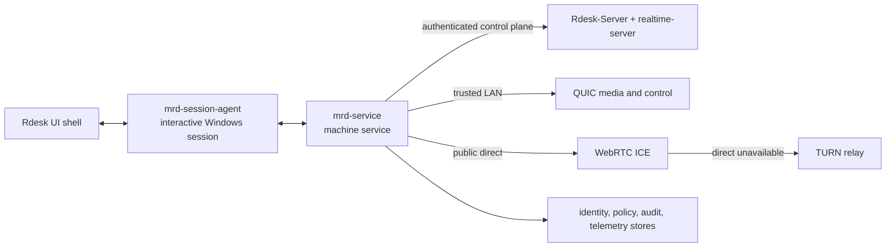
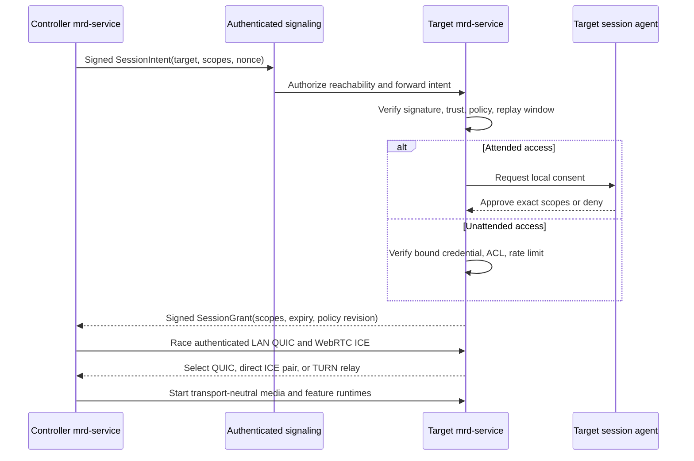

# Market Remote Capability Alignment Design

**Date:** 2026-07-11
**Status:** Approved
**Scope:** Full market-capability alignment program, beginning with a Windows-first product baseline and continuing through mainstream cross-platform and advanced capability parity.

## Goal

Evolve `mini-remote-desktop` from a strong LAN media implementation into a complete remote-access product whose connectivity, authorization, unattended access, interaction features, reliability, security, and verification are comparable with established remote desktop software.

The goal is not satisfied by adding feature flags, protocol DTOs, local-only implementations, synthetic tests, or peak media benchmarks. A capability counts only when the active product path implements it end to end and the corresponding product-level acceptance gate passes.

## Decision Summary

Adopt a layered dual-mainline architecture:

- authenticated device/account control plane inspired by mature ID/rendezvous systems;
- QUIC for trusted LAN and managed-network high-performance sessions;
- WebRTC ICE for public-network direct connectivity;
- TURN for deterministic relay and UDP-blocked environments;
- one transport-neutral session, authorization, control, feature, and telemetry model owned by `mrd-service`;
- one Windows machine service plus one desktop-bound agent per interactive Windows session;
- `Rdesk` remains a replaceable UI shell;
- market alignment is delivered through P0, P1, and P2 gates, not through a collection of unverified implementations.

The selected route order is:

```text
authenticated LAN QUIC
  -> WebRTC direct candidate pair
  -> WebRTC TURN relay
```

An optional QUIC relay can be evaluated later as a performance optimization. It is not the initial public-network foundation because doing so would require the project to invent NAT traversal, relay allocation, application-layer end-to-end encryption, abuse controls, and TCP/TLS 443 fallback in parallel.

## Evidence And Current Baseline

The active repository already has valuable product foundations:

- real LAN discovery and a service-owned QUIC media sender/receiver path;
- Windows DXGI/WinRT capture, NVENC/OpenH264 encode, NVDEC/software decode, and D3D11 render paths;
- macOS and Linux capture/decode/render building blocks with lower product parity;
- Windows keyboard and mouse capture, LAN forwarding, and `SendInput` injection;
- media profile negotiation, adaptation, diagnostics, benchmark scripts, and device-lab workflow scaffolding;
- service-owned IPC, session registries, audit DTOs, pairing DTOs, capability snapshots, and a thin-shell migration direction.

The current product evidence also establishes important limits:

- the active end-to-end product path is LAN QUIC; WAN/NAT/TURN is not wired into `mrd-service`;
- `realtime-server` routes unauthenticated in-memory signaling messages and trusts caller-provided device IDs;
- pairing, trust, and audit state are in-memory registries and do not authorize the LAN auto-accept path;
- access passwords are UI-local and do not participate in a service-side authenticated handshake;
- LAN control input is not cryptographically bound to a trusted device and granted session;
- file transfer currently copies local service-host paths rather than transferring to a peer;
- clipboard synchronization exists only in legacy protocol definitions;
- system audio is explicitly advertised as unimplemented;
- display selection exists, but simultaneous multi-display product behavior and virtual display support do not;
- repository tests prove many components and local paths, but committed evidence does not prove the complete real two-device market experience;
- several scripts can produce a failed report while exiting successfully, and required latency fields can be absent without failing the gate.

These findings make the highest-priority gap a product/control/security/verification gap, not another isolated encoder optimization.

## Market Baseline

Official TeamViewer, AnyDesk, RustDesk, ToDesk, and Sunlogin product documentation was used to normalize the comparison. Vendor peak-performance claims are not treated as acceptance evidence without controlled measurement.

### Minimum Market Baseline

- attended and unattended access;
- automatic direct-to-relay connectivity across common NAT and firewall conditions;
- encryption that prevents the relay from reading session content;
- adaptive 1080p60-class desktop interaction on capable Windows hardware;
- keyboard, pointer, UAC, lock-screen, reconnect, and remote restart support;
- multi-monitor selection;
- bidirectional file transfer, text clipboard, and remote system audio;
- explicit permissions, user-visible incoming-session state, trusted device identity, and audit events;
- Windows controller and agent support plus a credible cross-platform expansion path.

### Mainstream Level

- 2K/4K60, hardware H.264/H.265 and optional AV1, high-fidelity chroma modes;
- simultaneous or independent-window multi-monitor behavior and virtual/headless displays;
- drag/drop, file clipboard, resumable file manager workflows;
- session recording, privacy screen, local-input blocking, end-of-session lock;
- 2FA, allowlists, device ACLs, Web viewer, mobile controller, remote terminal, printing, and tunnels.

### Advanced Level

- 144 Hz and higher-refresh specialist modes, HDR, multi-virtual-display workflows;
- multi-controller collaboration, annotation, screen walls, peripherals, and mobile agents;
- multi-region relays and enterprise HA;
- SSO, SCIM, RBAC, fleet policy, forced recording, server-side audit, and compliance exports.

## Alternatives Considered

### Alternative A: Layered Dual Mainline — Selected

Use authenticated signaling and session grants for control; retain QUIC for LAN; use WebRTC ICE/TURN for WAN.

Advantages:

- preserves the strongest existing media path;
- uses mature public-network standards and TURN relay semantics;
- creates a direct browser and mobile expansion path;
- allows TURN to relay DTLS-SRTP/DataChannel ciphertext;
- does not make public-network acceptance depend on custom NAT traversal.

Costs:

- requires two transport adapters;
- requires strict abstraction so features, permissions, telemetry, and recovery are not duplicated;
- requires profile parity rules between QUIC and WebRTC.

### Alternative B: Unified QUIC Across LAN, WAN, And Relay

Use the existing QUIC media protocol for direct and relayed traffic.

Advantages:

- maximum reuse of the current LAN data plane;
- one packetization and feature transport model;
- good high-performance potential.

Rejected as the initial public-network path because the project would need to build and operate rendezvous, NAT characterization, hole punching, UDP-blocked fallback, relay allocation, relay abuse control, congestion fairness, and an inner end-to-end encryption layer when the relay terminates outer QUIC.

### Alternative C: Bridge A Mature Remote Engine

Use a separate RustDesk-like engine for WAN and retain MRD for LAN.

Advantages:

- shortest apparent route to broad feature availability.

Rejected because it creates split device identity, session truth, policy, diagnostics, UI behavior, and release evidence. It also introduces protocol stability and licensing constraints and prevents the repository architecture from becoming the single source of product truth.

## Target Architecture



### Ownership Rules

`mrd-service` is the authoritative machine-level owner of:

- device identity and private-key access;
- trust, unattended credentials, permission policy, revocation, and audit;
- session authorization and lifecycle;
- signaling registration and session grants;
- route selection, transport health, migration, reconnect, and leases;
- product-level capability evaluation and profile selection;
- desktop-agent grants and supervision;
- canonical telemetry and release artifacts.

`mrd-session-agent` is the desktop-bound execution worker for one Windows logon session:

- local consent UI integration and visible session indication;
- desktop/window capture;
- input injection and pressed-state cleanup;
- audio capture/playback;
- clipboard access;
- user-scoped file access;
- native render-surface integration;
- lock, desktop-switch, and session-transition observation.

`Rdesk` owns:

- user interaction and navigation;
- local settings presentation;
- native window and render-surface lifecycle;
- consent and policy UI delegated through typed service/agent commands;
- diagnostics presentation.

`Rdesk` must not own identity secrets, decide authorization, invent session truth, or transport high-bandwidth frames through React/WebView.

`Rdesk-Server` owns:

- accounts, device directory membership, and service-side access tokens;
- authorization to discover/contact a device;
- short-lived TURN credentials or integration with a TURN credential service;
- server-side fleet and enterprise policy added in later phases.

Account membership only provides reachability. It never creates local device trust automatically.

`realtime-server` owns:

- authenticated WSS device presence;
- challenge-based registration bound to a device key and backend device token;
- idempotent session-intent routing;
- candidate, offer, answer, close, and reconnect message routing;
- TTL, rate-limit, replay, and route authorization enforcement;
- horizontally scalable ephemeral state in later phases.

It must not receive media content or make final local authorization decisions.

## Repository Component Map

### Domain And Application Crates

`crates/mrd-session` will own:

- the transport-independent `RemoteSessionAggregate`;
- authorization, route, media, and presentation states;
- requested and granted permission scopes;
- session lease and policy revision;
- route migration and terminal transition invariants;
- stable product failure reasons.

`crates/mrd-application` will own use cases and ports for:

- request/accept/deny session;
- interactive and unattended authorization;
- grant issuance and verification;
- route planning and migration;
- desktop-agent selection and capability grants;
- reconnect and recovery;
- permission change and revocation;
- feature start/stop orchestration;
- audit and telemetry emission.

New `crates/mrd-identity` will own persistence-independent logic for:

- device signing identity;
- signed session intents and grants;
- short authentication string derivation;
- transport fingerprint binding;
- key rotation proofs and key epochs;
- transcript-bound unattended credential proof contracts;
- replay windows and monotonic counters.

New `crates/mrd-agent-ipc` will own the private machine-service/session-agent protocol:

- agent registration and Windows session binding;
- capability advertisement;
- short-lived execution grants;
- consent request/result;
- capture, input, audio, clipboard, file, and render commands;
- lifecycle and desktop-transition events.

New `crates/mrd-quality-gate` will become the only release verdict evaluator.

### Infrastructure Adapters

- `mrd-transport-quic-quinn`: LAN QUIC route adapter.
- `mrd-transport-webrtc`: complete WebRTC PeerConnection, RTP, DataChannel, ICE, TURN, route evidence, and restart adapter.
- `mrd-signal-client`: authenticated WSS connection, reconnect, and typed signaling.
- a new persistent store adapter under `crates/` for SQLite state and append-only audit records.
- Windows DPAPI and ACL adapter for protected machine secrets.
- Windows SCM, session discovery, process launch, and secure private IPC adapters.

### Applications

- `apps/mrd-service`: machine service and sole product orchestrator.
- `apps/mrd-session-agent`: per-interactive-session desktop worker.
- `apps/Rdesk`: UI shell.
- `apps/realtime-server`: authenticated signaling/rendezvous service.
- `apps/Rdesk-Server`: account, device directory, TURN credentials, and later enterprise services.

## Device Identity And Trust

### Stable Machine Identity

Each installation creates a long-term signing key and public device identity. On Windows:

- the private key is protected with DPAPI machine scope;
- the containing directory and database use a DACL restricted to the service SID and required system principals;
- the private key is never exposed to Rdesk, WebView, or the user-session agent;
- public-key identifier, epoch, and rotation metadata are non-secret and auditable.

DPAPI machine scope is not a substitute for filesystem ACLs. Both are required.

### Peer Trust State

```text
Unseen
  -> PairingPending
  -> AwaitingLocalApproval
  -> Trusted
  -> Suspended | RotationPending | Revoked
```

Rules:

- first pairing verifies a full signed handshake and displays a short authentication string derived from the transcript;
- local approval pins the peer public key, not a mutable device label or server account;
- reconnect verifies the pinned key and current epoch;
- rotation requires a new key signed by the previous trusted key and a strictly increasing epoch;
- a lost or compromised previous key requires re-pairing;
- revocation immediately closes active sessions, invalidates leases and unattended credentials, and prevents silent re-trust;
- server account login never changes peer trust.

### Unattended Credential

Unattended access is disabled by default and explicitly enabled on the target machine.

The initial machine-generated credential:

- contains at least 128 bits of randomness;
- is displayed once and never stored in UI local storage;
- is independent from account credentials;
- is optionally restricted to trusted peer keys and a permission profile;
- is verified with a transcript-bound challenge and never sent as plaintext;
- supports rotation, revocation, expiry, failure counters, exponential delay, and lockout;
- never grants permissions beyond the configured unattended profile.

If human-selected low-entropy passwords are added, they require a reviewed PAKE design rather than an ordinary password hash challenge.

## Session And Authorization Model

The current transport lifecycle is insufficient to distinguish trust, user consent, route state, and media state. The new aggregate keeps these dimensions explicit.

### Authorization State

```text
Discovered
  -> Authenticating
  -> Authorizing
  -> AwaitingLocalConsent | VerifyingUnattendedCredential
  -> Granted
  -> Denied | Expired | Revoked | LockedOut | PolicyChanged
```

### Route State

```text
Idle
  -> Gathering
  -> Connecting
  -> Connected(LanQuic | WebRtcDirect | WebRtcRelay)
  -> Migrating
  -> Reconnecting
  -> Failed | Closed
```

### Media State

```text
Idle
  -> Starting
  -> Streaming
  -> Degraded | Paused
  -> Stopped | Failed
```

### Presentation State

The UI-facing lifecycle is derived from authoritative sub-states and includes:

- incoming approval required;
- authenticating;
- connecting;
- connected without media;
- streaming;
- degraded;
- reconnecting;
- denied;
- failed;
- closed.

It must not claim a controllable session merely because a socket is connected.

### Permission Scopes

The initial normalized permission set includes:

- `screen.view`;
- `input.pointer`;
- `input.keyboard`;
- `clipboard.read` and `clipboard.write`;
- `file.read` and `file.write`;
- `audio.listen` and `audio.talk`;
- `display.switch` and `display.multi_view`;
- `power.restart` and `power.shutdown`;
- `terminal.open`;
- `privacy.block_local_input` and `privacy.blank_screen`;
- `secure_desktop.view` and `secure_desktop.control`.

The effective grant is the intersection of:

```text
requested scopes
  ∩ peer trust ceiling
  ∩ local machine policy
  ∩ unattended profile or this-session consent
  ∩ current runtime capability
```

Permission escalation during a session requires a new local approval or an already-authorized policy transition. Permission reduction and revocation take effect immediately.

### Session Grant

A signed session grant binds:

- session ID;
- initiator and target device keys;
- exact permission scopes;
- issuance and expiry time;
- policy revision;
- transport/profile constraints;
- replay nonce;
- approved Windows session ID;
- transport fingerprint commitments.

No capture, media send, or input injection starts before a valid grant exists.

## Connection Flow



Route candidate collection may begin before local consent to reduce latency, but no desktop content or input operation may start before authorization.

## TransportMux

All product features use one transport-neutral interface. QUIC and WebRTC are adapters, not separate products.

Logical lanes:

- `video`: encoded video media;
- `audio`: encoded system/microphone audio;
- `ctrl_rel`: reliable ordered key/button state, authorization, profile, clipboard, power, and feature control;
- `ctrl_rt`: low-latency coalesced pointer motion, wheel, cursor, and optional prediction events;
- `file_bulk`: independent reliable transfer streams with flow control and resume metadata;
- `telemetry`: low-priority structured diagnostics.

Required properties:

- critical key/button transitions are reliable and ordered;
- realtime motion can be dropped or replaced when stale;
- `ReleaseAll` is sent on focus loss, permission loss, desktop switch, route close, and session termination;
- bulk file transfer cannot head-of-line block input or session control;
- every frame is bound to a session grant and permission scope;
- route adapters expose selected-path evidence, congestion/health events, and migration support;
- features cannot inspect concrete Quinn or WebRTC types.

## Route Planning And Migration

### Route Selection

The service gathers authenticated LAN and ICE candidates in parallel.

1. Use LAN QUIC when a signed LAN identity matches the intended trusted device and the QUIC handshake succeeds.
2. Otherwise use the selected WebRTC direct candidate pair.
3. Otherwise use TURN relay.
4. If the policy requires relay, only a real relay candidate pair is accepted.

A policy field such as `relay_required` is not route evidence. The selected ICE candidate pair and server allocation must be recorded.

### Migration

- direct WebRTC can perform ICE restart and migrate to relay;
- LAN QUIC failure can fall back to WebRTC under the same still-valid session grant;
- migration never broadens permissions;
- route downgrade that violates a security or exact-profile policy fails closed;
- route changes emit audit and telemetry events;
- input pressed state is released before a route is considered lost;
- reconnect preserves the logical session ID, peer binding, and approved scopes only while the lease and policy revision remain valid.

## Windows Process Model

Windows services run in Session 0 and cannot directly act as interactive desktop applications. `SendInput` is also restricted by User Interface Privilege Isolation. Therefore market-grade unattended access requires a split process model.

### Machine Service

`mrd-service` is installed through SCM and runs under a dedicated service identity.

It owns secrets, authorization, network transports, policy, audit, and agent supervision. It must not display UI or directly trust arbitrary local IPC callers.

### Session Agent

One `mrd-session-agent` runs in each supported interactive Windows session. It is launched or supervised using a validated Windows session token and registers through a private named pipe.

The private pipe:

- uses an explicit security descriptor;
- rejects anonymous, network, and unrelated logon-session clients;
- verifies process identity, token, logon SID, and Windows session ID;
- carries only short-lived capability grants;
- never gives the agent access to long-term identity or unattended secrets.

Fast user switching never silently redirects a remote session to a new user. The grant pins the target Windows session.

### Secure Desktop

P0 development may initially detect a secure desktop and fail safely, but Windows market-core acceptance cannot pass until a separately reviewed, signed, minimal-privilege secure-desktop broker supports the required UAC/lock-screen behavior.

The broker:

- has no public-network listener;
- has no access to long-term identity or unattended secrets;
- accepts only narrowly scoped, expiring grants from the machine service;
- provides only reviewed secure-desktop capture/input operations;
- emits complete audit events;
- is tested across UAC, lock, unlock, logon, and user-switch transitions.

Disabling Windows secure desktop or weakening host security is not an acceptable workaround.

## P0 Windows Market-Core Capabilities

P0 is not a demo milestone. Every item must pass the product gate.

### Connectivity And Session

- attended and unattended sessions;
- authenticated LAN QUIC;
- WebRTC public direct path;
- forced TURN path;
- automatic direct-to-relay fallback;
- disconnect detection, reconnect, and route migration;
- service and UI restart behavior;
- explicit same-device/multi-session resource policies;
- actionable preflight and failure reasons.

### Video And Interaction

- 1080p60 H.264 hardware path with software fallback;
- real capture-to-present evidence;
- adaptive bitrate/FPS/resolution ladder;
- native D3D11 presentation;
- pointer and keyboard control;
- reliable modifier/button handling and release cleanup;
- UAC and required secure-desktop behavior;
- selected monitor switching without losing authorization;
- cursor shape/position behavior sufficient for normal desktop use.

### Remote System Audio

- Windows WASAPI loopback capture;
- Opus encode/decode and playback;
- mute and volume controls;
- permission enforcement;
- independent audio failure/degradation state;
- audio/video synchronization telemetry.

### Clipboard

- bidirectional text clipboard;
- permission direction enforcement;
- loop prevention, size limits, rate limits, and content-type validation;
- no clipboard content in logs or audit records;
- clear UI state when clipboard is blocked.

### Remote File Transfer

- real peer-to-peer or relayed transfer, not service-local copy;
- directory listing through an authorized remote provider;
- file and directory upload/download;
- chunk hashes, final hash, temporary destination, and atomic completion;
- cancel, retry, resume, overwrite policy, and path validation;
- independent bulk flow control;
- permission and audit events without recording file content;
- cleanup after disconnect or failed verification.

### Multi-Monitor

- enumerate real peer monitors;
- switch selected monitor without a new trust decision;
- preserve coordinate origin/scaling and input mapping;
- expose capability limits truthfully;
- treat simultaneous multi-view as P1 rather than falsely advertising it in P0.

### Unattended, Privacy, And Power

- machine-level autostart/service lifetime;
- explicit unattended enablement and credential rotation;
- trusted-device ACL and permission profiles;
- visible incoming/active session indication;
- end-of-session lock policy;
- block-local-input/blank-screen behavior only where implemented safely;
- Wake-on-LAN and authorized restart/shutdown;
- audit for all high-risk operations.

## P1 Mainstream Parity

P1 extends product parity without weakening P0 gates:

- supported Windows/macOS/Linux controller and agent paths;
- Android/iOS controller and Web viewer;
- 2K/4K60 profiles;
- H.265 and AV1 selection plus high-fidelity chroma modes;
- simultaneous multi-monitor and independent-window layouts;
- virtual/headless displays;
- file clipboard and drag/drop;
- manual and automatic session recording;
- privacy screen, local-input blocking, and end-of-session policy coverage;
- 2FA, device allowlists, access profiles, and trusted-device management UI;
- remote terminal, TCP tunnel, and remote printing.

Each platform reports truthful partial capability until its own media, input, permission, and device-lab gates pass.

## P2 Advanced Capability Parity

- 144 Hz and specialist high-refresh profiles under explicit hardware/network gates;
- HDR and extended color pipelines;
- multiple virtual displays and screen-wall workflows;
- mobile-device agent support;
- multi-controller collaboration and annotation;
- tablet, gamepad, camera, microphone, and reviewed peripheral forwarding;
- multi-region relay selection and HA;
- SSO, SCIM, RBAC, fleet policy, forced recording, service-side audit, and compliance export.

P2 remains part of the overall alignment program. It does not block truthful declaration of a lower completed tier, but unimplemented P2 capabilities cannot be advertised as available.

## Persistent State And Security Boundaries

Machine-level persistent state lives under a protected product directory such as `%ProgramData%\MiniRemoteDesktop` on Windows.

Logical stores:

- `MachineIdentityStore`: key material, key ID, epoch, and rotation history;
- `TrustPolicyStore`: trusted peer keys, trust state, permission ceilings, unattended policy, revocations, and lockouts;
- `SessionStore`: resumable non-secret session leases and cleanup state where required;
- `AuditStore`: append-only events, monotonic sequence, integrity chain, retention, and export metadata.

Security rules:

- no default JWT secret or default administrator credential in a release configuration;
- server device tokens and TURN credentials are short-lived and rotatable;
- local IPC endpoints enforce user/session ACLs;
- service-side request handlers authenticate callers before dispatch;
- signed protocol messages include version, nonce, expiry, and intended peer;
- replay and downgrade tests are release gates;
- audit excludes passwords, keys, clipboard content, key text, media, and file content;
- storage corruption fails closed for new authorization and high-risk operations;
- retention and export do not silently expose private content.

## Error Model

Errors use stable machine-readable reason codes plus a human explanation and suggested action.

### Security-Terminal Errors

Examples:

- `identity_mismatch`;
- `trust_required`;
- `consent_denied`;
- `credential_invalid`;
- `credential_locked`;
- `grant_expired`;
- `grant_revoked`;
- `policy_changed`;
- `replay_detected`;
- `scope_denied`;
- `protocol_downgrade_blocked`.

These fail closed and never trigger an insecure fallback.

### Route-Recoverable Errors

Examples:

- `lan_unreachable`;
- `ice_direct_failed`;
- `turn_allocation_failed`;
- `route_lost`;
- `route_migration_timeout`.

The service may try another policy-allowed route while the grant remains valid.

### Media-Degradable Errors

Examples:

- `encoder_unavailable`;
- `decoder_unavailable`;
- `capture_source_lost`;
- `profile_downgraded`;
- `congestion_downshift`;
- `render_budget_exceeded`.

Interactive sessions may continue with a truthful degraded state. Exact-profile acceptance scenarios fail.

### Feature-Scoped Errors

Clipboard, audio, file, display, printing, or terminal failure revokes or degrades only that feature when the remaining session is still safe. Required-scenario gates still fail.

### Infrastructure Errors

Test-lab, artifact, runner, and external-service failures are separate from product failures. They never count as a product pass.

## Canonical Telemetry And Artifact

All L1-and-higher runs write `remote-experience-run.v2`.

Required evidence includes:

- run, scenario, commit, build, device, OS, hardware, and policy IDs;
- redacted identity key IDs and trust/authorization transitions;
- requested and granted permission scopes;
- requested and selected profiles;
- route candidates, selected ICE candidate pair or QUIC evidence, route transitions, and relay proof;
- capture, encode, send, receive, decode, render-upload, and present metrics;
- true visible-first-frame time measured at successful present;
- input-to-photon probes;
- sustained presented FPS, frame intervals, freezes, stalls, drops, and queues;
- bandwidth, retransmission, congestion, and adaptation events;
- per-side CPU, GPU, RSS, VRAM, and growth rates;
- disconnect, reconnect, route migration, service restart, and recovery events;
- security-negative result and related audit event IDs;
- artifact manifest and final verdict.

Screenshots or media artifacts are opt-in and privacy-controlled. Missing optional artifacts are represented as missing, never fabricated.

## Quality Gate

One Rust evaluator under `crates/mrd-quality-gate` validates schema, required evidence, policy, thresholds, and verdict.

Allowed verdicts:

- `PASS` — exit 0;
- `PRODUCT_FAIL` — exit 2;
- `INFRA_FAIL` — exit 3;
- `INVALID_ARTIFACT` — exit 4;
- `ALLOWED_SKIP` — exit 0 only when scenario, capability, and reason are explicitly allowlisted.

Rules:

- required `null`, NaN, infinity, or zero-sample metrics produce `INVALID_ARTIFACT`;
- report production and verdict evaluation are separate;
- `completed` means orchestration completed, not that the product passed;
- required Windows 1080p60 release rows cannot skip for unsupported capability, profile downgrade, or display limitation;
- component, transport, paired, and dual-process scripts propagate the evaluator exit code;
- CI always uploads artifacts, then runs a final non-optional enforcement step;
- retries preserve first-attempt evidence and cannot erase a product regression.

## P0 Experience SLO

Baseline environment:

- Windows 11 controller and target;
- one 1920x1080@60 display;
- hardware H.264 path with real D3D11 present;
- ten-minute deterministic mixed desktop workload;
- direct network RTT no greater than 80 ms;
- relay network RTT no greater than 120 ms.

| Metric | Public Direct | Forced Relay |
| --- | ---: | ---: |
| Connection success, rolling sample >= 1000 | >= 99.9% | >= 99.9% |
| Visible first frame p50 / p95 / p99 | <= 1.5 / 2.5 / 4.0 s | <= 2.0 / 3.0 / 5.0 s |
| Input-to-photon p50 / p95 / p99 | <= 70 / 125 / 175 ms | <= 100 / 175 / 250 ms |
| Presented FPS median / one-second p5 | >= 59 / 55 | >= 58 / 52 |
| Frame interval p95 | <= 25 ms | <= 33 ms |
| Stalls greater than 500 ms | 0 per 10 min | 0 per 10 min |
| Freeze count / duration ratio | <= 1 / <= 0.1% per 10 min | <= 2 / <= 0.2% per 10 min |
| Dynamic workload bandwidth avg / one-second p95 | <= 15 / 25 Mbps | <= 18 / 30 Mbps |
| Sender / receiver CPU p95 | <= 25% / 20% | same |
| GPU p95 / VRAM per side | <= 60% / 1 GiB | same |
| Rdesk + service RSS p95 | <= 1.5 GiB | same |
| Steady RSS slope / 8-hour growth | <= 5 MiB/h / 100 MiB | same |
| Recovery after a 3-second outage | >= 99%; p95 <= 3 s | >= 99%; p95 <= 5 s |
| Direct-to-relay migration | >= 99.5%; p95 <= 8 s | not applicable |
| Eight-hour soak | zero crash, session loss, or >2 s stall | same |
| Security-negative suite | 100% reject, zero side effect, complete audit | same |

### Weak-Network Gates

Moderate:

- RTT 80 ms;
- jitter 20 ms;
- random loss 1%;
- bandwidth 8 Mbps;
- one-second-window FPS p5 at least 45;
- input-to-photon p95 at most 250 ms;
- adaptation completes within 5 seconds.

Harsh:

- RTT 150 ms;
- jitter 40 ms;
- random loss 3%;
- bandwidth 5 Mbps;
- connection success at least 99%;
- one-second-window FPS p5 at least 24;
- downshift within 8 seconds;
- no crash or stall longer than 2 seconds.

UDP-blocked scenarios must prove a selected relay candidate pair.

## Test And Release Topology

### L0 — Every Pull Request

Generic Linux and Windows runners, target duration under ten minutes:

- domain state machine and invariant tests;
- identity, signature, rotation, replay, grant, and policy tests;
- IPC and signaling contracts;
- quality-gate schema, missing-field, skip-policy, and exit-code tests;
- frontend report/status classification tests;
- script helper tests;
- synthetic media pipeline tests.

### L1 — Relevant Pull Requests

Windows GPU runner, target duration under twenty minutes:

- component matrix with fail-closed thresholds;
- hardware 1080p60 local chain;
- local dual-service session and cleanup;
- real native present and input acknowledgment;
- required check for session, transport, render, input, or feature changes.

### L2 — Nightly Device Lab

Two independent Windows peers across controlled NAT:

- direct and forced-relay connection attempts;
- ten-minute experience runs per route;
- moderate weak network;
- three-second outage and route recovery;
- core security-negative suite;
- actual candidate-pair and relay evidence.

### L3 — Daily And Release Candidate

- rolling 1000-attempt connection evidence per route;
- thirty-minute and two-hour soak;
- UDP-blocked relay;
- harsh weak network;
- service/signaling/TURN restart and reconnect;
- version and capability downgrade matrix.

### L4 — Weekly And Release

- eight-hour direct and relay soak;
- UAC, lock/unlock, logon, fast user switch, and service restart;
- storage corruption and recovery;
- key rotation and revocation;
- full Windows P0 capability matrix;
- cross-platform P1 matrices as those tiers mature.

## Delivery Slices

These are vertical delivery slices, not scope reductions. The active alignment goal remains open until the agreed tier evidence passes.

### Slice 0: Truthful Evidence

- add the canonical quality gate and schema;
- make component, transport, dual-process, and paired scripts fail closed;
- split producer status from gate verdict;
- fix the known E2E color/profile classification regression;
- make current evidence trustworthy before using it to claim progress.

### Slice 1: Secure LAN Session

- add the session authorization aggregate and scope model;
- add persistent machine identity, trust, audit, and revocation;
- sign/bind LAN identity and session bootstrap;
- replace LAN auto-accept with interactive/unattended authorization;
- bind control input to trusted device, grant, scope, and replay sequence;
- keep the existing LAN media pipeline as the first secure vertical path.

### Slice 2: Windows Machine Service And Session Agent

- introduce private agent IPC and Windows session binding;
- move desktop-bound operations behind the agent;
- install and supervise the machine service and agents;
- enforce local IPC ACLs and short-lived grants;
- preserve current media performance through a measured process boundary.

### Slice 3: Deterministic Public Relay

- authenticate signaling registration and session routes;
- complete service-owned WebRTC PeerConnection support;
- provision TURN and short-lived credentials;
- pass forced-relay H.264 video and reliable input end to end;
- record actual relay evidence and P0 baseline metrics.

### Slice 4: Automatic Connectivity And Recovery

- race authenticated LAN and ICE routes;
- implement direct-to-relay migration and ICE restart;
- implement real reconnect rather than state reset;
- add ABR/profile adaptation and recovery telemetry;
- pass direct, relay, weak-network, and outage gates.

### Slice 5: P0 Feature Completion

- remote system audio;
- bidirectional text clipboard;
- resumable remote file transfer;
- monitor switching and input-coordinate correctness;
- unattended policy, WOL, restart/shutdown, and visible session controls;
- secure desktop/UAC broker and acceptance;
- complete P0 device-lab and soak evidence.

### Slice 6: P1 Mainstream Parity

- cross-platform controller/agent rollout;
- mobile controllers and Web viewer;
- 2K/4K60 and codec/fidelity expansion;
- simultaneous/virtual displays;
- recording, file clipboard/drag-drop, privacy, 2FA/ACL, printing, terminal, and tunnel;
- per-platform release gates.

### Slice 7: P2 Advanced Parity

- high refresh/HDR;
- advanced displays, collaboration, peripherals, and mobile agents;
- multi-region/HA relay;
- enterprise identity, policy, audit, and compliance features;
- advanced capability matrices and release evidence.

## Migration And Compatibility Rules

- preserve current LAN QUIC media behavior while moving authorization and ownership boundaries;
- no feature may silently fall back to an unauthenticated legacy path;
- old peers without identity, protocol version, or capability evidence are explicitly incompatible or diagnostic-only;
- capability snapshots distinguish implemented, available, degraded, unsupported, and unimplemented;
- a DTO, capability flag, or local-only handler never upgrades a feature to available;
- third-party GPL/AGPL projects remain references unless the repository intentionally accepts their license obligations;
- `junk/` and `refs/` do not define product architecture;
- every accepted route and feature is service-owned and auditable;
- performance work cannot bypass security or quality gates.

## Non-Goals Of The First Implementation Slice

Slice 0 does not implement WAN, identity, audio, clipboard, file transfer, or secure desktop. Its purpose is to make evidence truthful so later slices cannot appear complete while failing their own requirements.

This is sequencing, not a redefinition of the full objective. The program scope remains P0 through P2 as described above.

## Completion Rules

A capability is complete only when all of the following are true:

1. the active product entry point exposes it;
2. both peers negotiate it truthfully;
3. authorization and permission policy cover it;
4. it works over every route required by its tier;
5. errors, fallback, cleanup, and audit are implemented;
6. required metrics are present and valid;
7. the canonical gate passes on the required device-lab topology;
8. no lower-parity implementation is advertised as equivalent;
9. documentation and operational configuration match runtime behavior.

The overall goal is not complete until the selected market tier is proven requirement by requirement against current artifacts. Missing or indirect evidence counts as incomplete.

## Reference Material

Primary market references used during design:

- [TeamViewer Remote knowledge base](https://www.teamviewer.com/en/global/support/knowledge-base/teamviewer-remote/)
- [AnyDesk features](https://anydesk.com/en/features)
- [RustDesk documentation](https://rustdesk.com/docs/en/)
- [ToDesk product documentation](https://www.todesk.com/about.html?lang=zh)
- [Sunlogin product features](https://sunlogin.oray.com/product/feat)

Windows security/process references:

- [Microsoft: Interactive Services](https://learn.microsoft.com/en-us/windows/win32/services/interactive-services)
- [Microsoft: SendInput and UIPI](https://learn.microsoft.com/en-us/windows/win32/api/winuser/nf-winuser-sendinput)
- [Microsoft: Remote Desktop Sessions](https://learn.microsoft.com/en-us/windows/win32/termserv/terminal-services-sessions)
- [Microsoft: Data Protection API](https://learn.microsoft.com/en-us/windows/win32/api/dpapi/nf-dpapi-cryptprotectdata)
