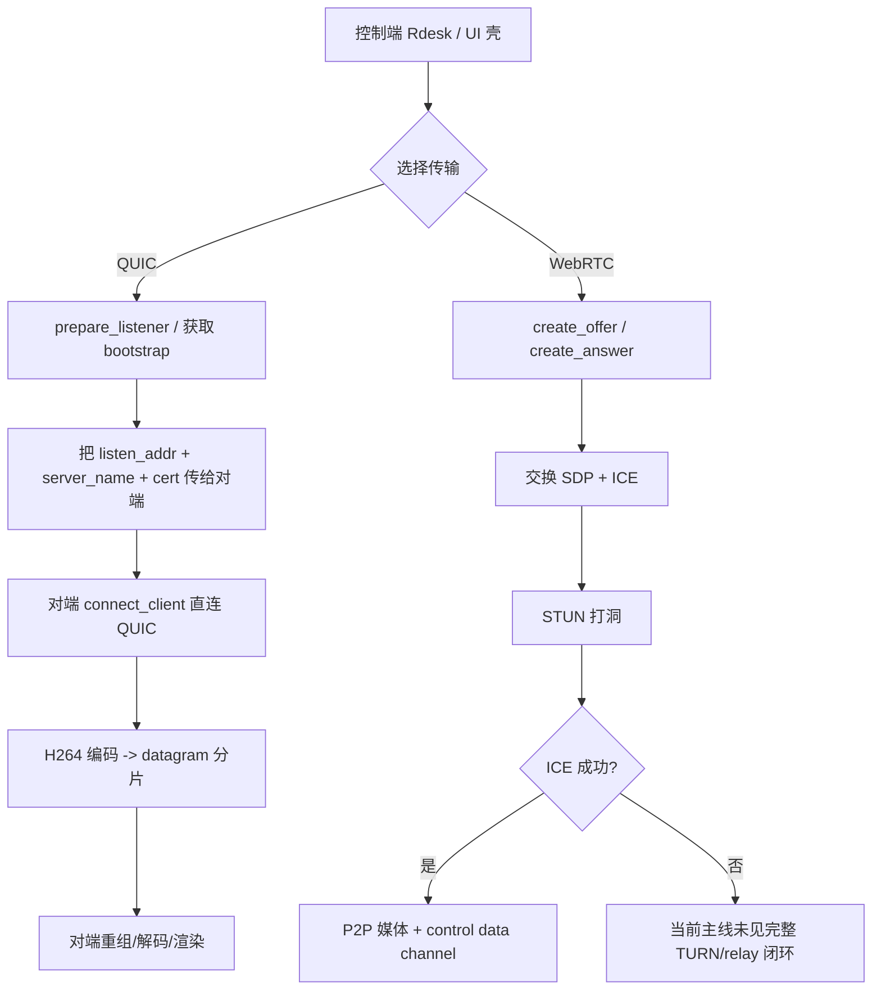

# 端到端远程桌面传输审查报告

## 执行摘要

本次审查先从你已启用的连接器入手；就当前会话可用连接器而言，只有 **GitHub**，因此我优先使用 GitHub 连接器审查了指定仓库 `a1112/mini-remote-desktop`，随后才补充官方文档、RFC、官方仓库与原始论文等公开资料。综合代码、README、测试与周边资料后，我的结论是：**你现在遇到的“E2E 基本无法使用”并不是偶发故障，更像是当前主线设计与验证闭环尚未完成的结构性结果。** 仓库 README 已明确标注该项目仍处于“mid-rebuild”，且主线正在向“薄壳 + 本机服务”迁移；`junk/` 被明确降级为历史参考，不应当再被视作主线架构依据。fileciteturn79file0L1-L3

就传输实现而言，当前主线实际上分成两条：一条是 **自定义 QUIC datagram 媒体链路**，另一条是 **WebRTC PeerConnection 链路**。前者在活跃代码中已经具备 H.264 access unit 的分片、重组、发送与接收路径，但它依赖显式 bootstrap 信息和直接 UDP/QUIC 连接，本身**没有看到成熟的公网 NAT 穿透与 relay 闭环**；后者采用标准 Offer/Answer/ICE 思路，但当前主线里只看到单一 STUN 服务器，没有看到可运营级 TURN 配置，控制信道还被设置成无序、零重传，这会直接放大真实公网环境下的连通性与控制可靠性问题。fileciteturn72file0L1-L3 fileciteturn67file0L1-L3

更关键的是，仓库里名为 “e2e” 的 QUIC 测试，当前大多验证的是 **loopback、配置对象、重组逻辑**，而不是“跨 NAT / 跨公网 / 丢包抖动 / relay 回退”的真实端到端条件。`e2e_integration.rs` 主要覆盖本机回环和分片重组；`e2e_low_latency.rs` 主要在测 pacer/FEC/NACK 配置本身；`e2e_recovery.rs` 也主要验证 reconnectable endpoint 抽象，并没有真正构造复杂中断恢复场景。换言之，**测试名叫 E2E，但证据链离生产可用的 E2E 还差一大截**。fileciteturn75file0L1-L3 fileciteturn76file0L1-L3 fileciteturn77file0L1-L3

如果目标是尽快出一份可落地的审查结论，那么最重要的判断是：**当前仓库更像“高性能媒体/桌面传输实验平台”，而不是已经完成公网穿透、身份信任、relay 回退、自动化验证闭环的远控产品。** 若你需要短期可用、可自建、可审计的方案，RustDesk 一类的 `hbbs + hbbr` 架构明显更接近产品态；若要继续自研，建议把自定义 QUIC 路径收敛到 **LAN / 受控网络 / 高帧率内网场景**，把公网 E2E 主线转向 **WebRTC + TURN** 或 **libp2p + relay/DCUtR** 这类成熟 NAT 穿透体系。RustDesk 官方文档明确给出了 “ID / rendezvous / signaling 服务器 + relay 服务器 + hole punching 失败回退 relay” 的产品化连接流程；libp2p 官方文档则给出了更通用的 AutoNAT / AutoRelay / Circuit Relay / DCUtR 组合，并且 2026 年的原始测量论文给出了约 70% 的条件性打洞成功率。citeturn15view0turn16view0turn16view1turn16view2 citeturn6view2turn5view1turn6view0turn3academia7

## 审查范围与证据边界

本报告的仓库审查范围仅限你指定的 `a1112/mini-remote-desktop`。从仓库 README 可以确认当前活跃主线根目录是 `apps/Rdesk`、`apps/Rdesk-Server`、`apps/realtime-server`、`crates/*`、`common-control-proto`、`heartbeat-rs`、`docs/`、`tests/`、`tools/`；同时 README 明确说明：`junk/` 只保留历史实现、调试脚本、实验产物和参考代码，**不应意外定义当前架构**。这一点很重要，因为仓库里仍然存在大量 WebTransport、旧 agent/controller、Qt/web client 等历史实现痕迹，极易把审查带偏。fileciteturn79file0L1-L3

对于代码定位，本次优先使用了 GitHub 连接器；但连接器返回私有源码时，**并不总能稳定暴露原始 GitHub 文件行号**。因此，本报告采用“**路径 + 关键函数 / 结构体**”作为主要代码定位方式；凡是连接器返回了可引用片段，我都在文中附上了 `filecite`。对外部资料，我只选用了官方文档、IETF RFC、W3C/MDN、官方 GitHub 仓库与原始论文。citeturn7view0turn8view0turn8view1turn8view2turn8view3turn15view0

需要特别说明的是：仓库 README 宣称“多协议支持：WebRTC、QUIC、WebTransport”，但 GitHub 连接器扫描结果显示，**WebTransport 的多数直接实现证据落在 `junk/` 与历史测试/实验路径中**；活跃主线中，真正被持续实现和测试的，是 QUIC 自定义媒体链路与 WebRTC 主机侧实现。因此，**WebTransport 不应在当前审查中被视为“已完成的主线能力”**。fileciteturn79file0L1-L3 fileciteturn80file0L1-L3 fileciteturn81file0L1-L3

## 仓库代码审查结论

### 架构状态与主线成熟度

仓库 README 明确写出该仓库正在迁移到“**Rdesk 仅为 UI 壳，mrd-service 为本机核心服务唯一入口**”的产品结构；但从活跃代码上看，`apps/Rdesk/src-tauri/src/` 目录下仍保留了大量 **QUIC 主机、WebRTC 主机、实时运行时** 等核心传输逻辑。这意味着从架构意图上，项目想收敛到服务中心化；但从代码现实上，**传输逻辑仍部分留在 UI 壳内**，这会直接导致排错路径、状态归因、日志归位和测试边界变得含混。fileciteturn79file0L1-L3 fileciteturn72file0L1-L3 fileciteturn65file0L1-L3

`crates/mrd-session/src/lib.rs` 里已经抽象出了 `SessionLifecycleState`、`QuicSessionSnapshot` 与 `QuicSessionCoordinator`，并把 QUIC 会话的 `listen_addr`、`server_name`、`cert_der_b64`、`lifecycle_state`、`last_error` 等都放进了领域快照，说明作者确实在把会话从“临时 transport 过程”提升为“可审计、可持久化、可回放”的领域状态。问题在于，**这个抽象层已经存在，但产品主线的“单一入口 + 单一状态机 + 单一路径日志”还没完全落地**。fileciteturn78file0L1-L3

### QUIC 主线的实现方式

活跃 QUIC 路径位于 `apps/Rdesk/src-tauri/src/quic_host.rs`。从 `prepare_listener`、`accept_peer`、`connect_to_peer`、`run_sender_loop`、`run_receiver_loop` 这些函数可以清楚看出，这条链路的核心思路是：服务端先 `bind` 一个 `QuinnServerListener` 拿到 `bootstrap`，客户端再拿着 `bootstrap` 去 `QuinnDatagramEndpoint::connect_client`；媒体帧经 H.264 编码后被切成 QUIC datagram，接收端再做重组与解码。发送和接收两端还都挂了 probe 与 snapshot，能记录 `remote_datagram_count`、`remote_access_unit_count`、`decoded_frame_count`、`last_error` 等诊断信息。fileciteturn72file0L1-L3

这条路径的优点是很明显的：它绕开 RTP/SDP/ICE 的复杂性，直接以 **自定义媒体分片协议 + QUIC datagram** 承载 H.264 access unit，理论上非常适合做 **内网、高帧率、低抖动、可控 MTU 的场景**。但它的硬伤也同样明显：**当前代码并没有给出公网 NAT 穿透闭环**。你可以看到它是“监听 → 拿 bootstrap → 直接拨号”，而不是“发现可达地址 → NAT 判定 → 打洞时钟同步 → 失败回退 relay”。因此，这条 QUIC 主线更像“受控网络高速通道”，而不是可直接替代 RustDesk 级公网穿透产品的传输骨架。fileciteturn72file0L1-L3

`apps/mrd-service/src/lan_discovery.rs` 进一步强化了这个判断。该文件定义了 `mrd-lan-discovery-v1` 的局域网发现协议，默认端口 `21116`，并在广播能力里显式宣布了 `quic_datagram`、`quic_datagram_2k144`、`quic_datagram_media_v2`、`quic_datagram_media_v3`、`quic_stream_media_v2` 以及媒体 profile / capture source 控制通道。`build_announcement` 还会附带设备、协议版本、build id 和媒体能力。这说明作者已经在认真做 **LAN 发现 + 媒体版本演进 + 能力协商**；但这也意味着当前最扎实的使用场景，仍然是 **LAN P2P / 同网段或可直达网络**，而不是复杂公网 NAT。fileciteturn73file0L1-L3 fileciteturn74file0L1-L3

### WebRTC 主线的实现方式

活跃 WebRTC 路径位于 `apps/Rdesk/src-tauri/src/webrtc_host.rs`。该文件已经具备较完整的主机端能力：可以 `create_offer`、`apply_remote_offer`、`create_answer`、`apply_remote_answer`、`apply_remote_ice_candidate`，并通过 `get_or_create_peer` 创建或复用会话级 `RTCPeerConnection`。同一文件的 `WebrtcHostSnapshot` 还记录了 offer/answer、ICE 数量、track 数量、RTP 包数量、乱序/序列缺口、解码后端选择、fallback 次数、解码错误、连接状态等，非常适合做调试与回归统计。fileciteturn65file0L1-L3

真正的问题出在 `build_peer_connection`。这里可以看到它只配置了一个公开 STUN 服务器 `stun:stun.l.google.com:19302`，并没有看到同等成熟的 TURN 凭据/地址配置；与此同时，它创建了一个名为 `control` 的 data channel，并显式设置为 `ordered: false`、`max_retransmits: 0`。这意味着当前控制通道被当作**低时延、不保证送达**的通道来用。对于实验型控制消息，这种设计可以理解；但对于真正的远控会话管理、输入事件与状态同步来说，这种默认值会显著放大复杂网络下的“偶发失控”和“状态漂移”。fileciteturn67file0L1-L3

从标准角度看，WebRTC 这一套本来就高度依赖 ICE/STUN/TURN。IETF 的 ICE 标准明确说明：ICE 是 UDP 通信的 NAT 穿透协议框架，它依赖 STUN 与 TURN；W3C 规范也明确 `RTCIceServer` 是用来描述 STUN/TURN 的，并允许把 `iceTransportPolicy` 设成 `relay` 只走中继候选。MDN 中文文档则更直白：对称 NAT 或严格路由器情形下，会从 STUN 退到 TURN，中继所有数据，成本更高但成功率更高。**你的仓库当前 WebRTC 主线只有 STUN，没有运营级 TURN，等于少了真正产品化穿透链路最关键的一段。** citeturn8view1turn8view2turn8view3turn9view0turn9view1

### 信任模型、密钥与测试证据

`mrd-session` 已经把 QUIC 会话的证书 DER、server name、listen address 都纳入快照状态，说明当前 QUIC 连接的认证材料是以 **会话 bootstrap 数据** 的形式在业务层传递和保存的。这个设计本身并不一定错误，但它把安全上限高度绑定到了“bootstrap 是否真实可信”。如果 bootstrap 通过信令或 IPC 层被注入、串改或重放，那么自签证书再完备，也只是把错误终点安全地连接起来。当前主线里，我没有看到与 RustDesk 公钥配置同等清晰的“长期身份 / 显式 pinning / 轮换策略 / UI 告警”证据。fileciteturn78file0L1-L3

测试证据也支持“主线未完成”的判断。`crates/mrd-transport-quic-quinn/tests/e2e_integration.rs` 的重点是本机 loopback、server bootstrap 元数据、分片/重组与 datagram 读写；`e2e_low_latency.rs` 更像是对 pacer/FEC/NACK 数据结构和默认值的自测；`e2e_recovery.rs` 也主要验证 reconnectable endpoint 和 health monitor 的状态切换。这里最缺的，是 **真实 NAT 组合、真实 TURN / relay 回退、真实丢包/重排/端口封锁、真实多客户端竞争**。fileciteturn75file0L1-L3 fileciteturn76file0L1-L3 fileciteturn77file0L1-L3

此外，`tests/python-core-transport/README.md` 仍然把自动化比较描述为面向 `agent-rust` 的 core-layer transport suite，覆盖 `webrtc`、`quic`、`webtransport`，并支持多终端压力测试与编解码/ROI 矩阵。但根 README 又明确要求不要把历史路径当成当前 source of truth。二者叠加的结果是：**性能与 E2E 证明链和活跃产品主线之间存在“证据漂移”**，这会让审查报告很难把“旧 harness 的通过”直接解释成“新主线的可用”。fileciteturn81file0L1-L3 fileciteturn79file0L1-L3

### 关键代码位置总表

| 路径 / 关键函数 | 审查结论 | 对 E2E 的意义 | 依据 |
|---|---|---|---|
| `README.md` | 仓库仍在 mid-rebuild，`junk/` 不是主线 | 解释了为何会出现“主线未成型 + 历史代码很多”的现象 | fileciteturn79file0L1-L3 |
| `crates/mrd-session/src/lib.rs` / `QuicSessionSnapshot`, `QuicSessionCoordinator` | 会话状态、证书、server name、地址都已纳入领域快照 | 有利于审计，但也暴露出 bootstrap 信任链是关键依赖 | fileciteturn78file0L1-L3 |
| `apps/Rdesk/src-tauri/src/quic_host.rs` / `prepare_listener`, `connect_to_peer`, `run_sender_loop`, `run_receiver_loop` | QUIC 是“bootstrap + 直接拨号 + 自定义 datagram 媒体链” | 低时延强，但公网 NAT 穿透能力明显不足 | fileciteturn72file0L1-L3 |
| `apps/mrd-service/src/lan_discovery.rs` / `build_announcement` | 明确围绕 LAN 能力发现、协议版本和媒体 profile 协商设计 | 说明当前最成熟场景更偏 LAN / 受控网络 | fileciteturn73file0L1-L3 fileciteturn74file0L1-L3 |
| `apps/Rdesk/src-tauri/src/webrtc_host.rs` / `create_offer`, `apply_remote_ice_candidate`, `build_peer_connection` | WebRTC 主线完整度较高，但只见 STUN 未见 TURN；control channel 设为无序零重传 | 公网复杂网络下控制面和连通性都偏脆弱 | fileciteturn65file0L1-L3 fileciteturn67file0L1-L3 |
| `crates/mrd-transport-quic-quinn/tests/e2e_integration.rs` | “E2E”主要是 loopback 与分片重组测试 | 不能证明公网 E2E 可用 | fileciteturn75file0L1-L3 |
| `crates/mrd-transport-quic-quinn/tests/e2e_low_latency.rs` | 更偏配置对象与默认值测试 | 不能证明真实低时延恢复路径 | fileciteturn76file0L1-L3 |
| `crates/mrd-transport-quic-quinn/tests/e2e_recovery.rs` | 更偏抽象状态机与接口自测 | 不能替代真实断链恢复测试 | fileciteturn77file0L1-L3 |
| `tests/python-core-transport/README.md` | 仍绑定历史 `agent-rust` core transport suite | 新主线与旧 harness 之间存在验证断层 | fileciteturn81file0L1-L3 |

## 关键发现与瓶颈清单

### 连接流程示意

下图概括了我基于仓库活跃代码得出的当前主线路径：QUIC 更像“自定义 bootstrap + 直接 UDP/QUIC 媒体通道”，WebRTC 更像“标准 offer/answer/ICE，但 NAT 穿透配置不完整”。相关依据来自 `quic_host.rs`、`webrtc_host.rs`、`lan_discovery.rs` 和 `mrd-session`。fileciteturn72file0L1-L3 fileciteturn67file0L1-L3 fileciteturn73file0L1-L3 fileciteturn78file0L1-L3

### 漏洞与瓶颈清单

| 问题 | 影响 | 风险等级 | 判定 | 依据 |
|---|---|---|---|---|
| QUIC 主线缺少公网 NAT 穿透与 relay 闭环 | 跨 NAT、CGNAT、企业网、移动网下连接成功率会很低 | 极高 | `prepare_listener`/`connect_to_peer` 是直接 bootstrap 拨号；LAN discovery 明显比公网打通更成熟 | fileciteturn72file0L1-L3 fileciteturn73file0L1-L3 |
| WebRTC 只见 STUN，未见运营级 TURN | 对称 NAT、严格防火墙、UDP 受限环境会频繁失败 | 极高 | 标准 WebRTC/ICE 需要 STUN + TURN；当前主线只看到单一 STUN 服务器 | fileciteturn67file0L1-L3 citeturn8view1turn8view2turn8view3turn9view1 |
| control data channel 被设为无序、零重传 | 控制面状态可能丢失、乱序、偶发失控 | 高 | 对实时控制消息非常激进，不适合作为默认产品配置 | fileciteturn67file0L1-L3 |
| QUIC 信任依赖 bootstrap 真实性，自签证书缺少清晰长期身份治理 | 可能出现错连、重放、bootstrap 注入后仍“安全握手”的问题 | 高 | 会话快照里保存 cert/server_name，反向说明 bootstrap 是信任根的一部分 | fileciteturn78file0L1-L3 |
| 仓库主线重建中，UI 壳与 service 边界未完全收敛 | 调试困难、日志分裂、状态归因混乱 | 高 | README 说要迁到 mrd-service 唯一入口，但活跃 transport 逻辑仍在 Rdesk | fileciteturn79file0L1-L3 fileciteturn72file0L1-L3 fileciteturn65file0L1-L3 |
| “E2E”测试并不覆盖真实公网 E2E | 容易把回环自测误判为生产可用 | 极高 | loopback / config / endpoint abstraction 为主，非真实 NAT/relay 场景 | fileciteturn75file0L1-L3 fileciteturn76file0L1-L3 fileciteturn77file0L1-L3 |
| 性能 harness 与活跃主线存在漂移 | 基准结果不能直接证明当前主线 | 中高 | `python-core-transport` 仍强调 `agent-rust`/`webtransport`，与 README 的“junk 非主线”存在张力 | fileciteturn81file0L1-L3 fileciteturn79file0L1-L3 |
| README 中的 WebTransport 能力更像历史/实验遗留 | 容易误导架构选型与对外交付口径 | 中 | 主线声明有 WebTransport，但可见实现证据主要在 `junk/` 与历史测试 | fileciteturn79file0L1-L3 fileciteturn80file0L1-L3 fileciteturn81file0L1-L3 |

我认为最致命的不是某一个具体 bug，而是 **“产品要求” 与 “验证手段” 之间的错配**：你需要的是跨公网、可审查、能稳定落地的远程桌面连接；但仓库当前最扎实的，是 LAN/受控网络下的高性能传输实验路径，以及本机/回环级别的 transport 自测。这个错配本身，就足以解释“E2E 基本无法使用”。fileciteturn72file0L1-L3 fileciteturn73file0L1-L3 fileciteturn75file0L1-L3

## 常见开源传输库与 RustDesk 对比

### 对比表

| 方案 | 协议 | 加密 / 认证 | NAT 穿透 | 信令 | relay 支持 | 端到端加密可行性 | 易用性 | 成熟度 | 主要依赖 / 组件 | 依据 |
|---|---|---|---|---|---|---|---|---|---|---|
| `mini-remote-desktop` QUIC 主线 | QUIC datagram + 自定义 H.264 分片/重组 | 会话 bootstrap 携带 cert/server_name，安全性取决于 bootstrap 真实性 | 目前更偏直连 / LAN；未见成熟公网打洞闭环 | 外部 bootstrap / 会话编排 | 当前主线未见类似 hbbr 的通用 relay | 理论可行，但身份治理尚不清晰 | 低 | 低到中 | quinn 风格 endpoint、自定义 reassembler、OpenH264/NVENC、DXGI | fileciteturn72file0L1-L3 fileciteturn78file0L1-L3 |
| `mini-remote-desktop` WebRTC 主线 | Offer/Answer + ICE + RTP/DataChannel | WebRTC 自身支持 DTLS 证书；当前仓库更多依赖默认 PeerConnection 安全 | 只见 STUN，未见可运营 TURN | 需要外部 signaling | 若补 TURN 可做；当前证据不足 | 高 | 中 | 中 | `webrtc` crate、H264 RTP sender、PeerConnection | fileciteturn65file0L1-L3 fileciteturn67file0L1-L3 |
| libp2p | 多传输可插拔，含 QUIC / TCP / WebRTC / WebTransport | 官方安全通道为 TLS 1.3 与 Noise；QUIC 自带加密 | AutoNAT + AutoRelay + Circuit Relay + DCUtR；论文给出约 70% 条件性成功率 | 不强依赖中心化 signaling，可借发现 / relay / DHT / rendezvous 机制 | 有 | 高 | 中 | 高 | libp2p stack + relay/DCUtR | citeturn6view2turn5view1turn6view0turn3academia7 |
| WebRTC | ICE/STUN/TURN/SDP，媒体走 RTP，数据走 DataChannel | 证书、DTLS、ICE server 配置标准化；证书可持久化复用 | 标准上最成熟，TURN 是兜底关键 | 需要应用自建 signaling | 原生支持 TURN relay | 很高 | 中 | 很高 | 浏览器 / 原生 PeerConnection、TURN、STUN | citeturn8view1turn8view2turn8view3turn9view0turn9view1 |
| QUIC | UDP 上的多路复用安全传输 | RFC 9001 明确使用 TLS 保护 QUIC | **协议本身**提供迁移与路径验证，但不等于内建 NAT 打洞；公网穿透仍需额外机制 | 应用自建 | 外部实现 | 高 | 中 | 很高 | QUIC + TLS 1.3 | citeturn7view0turn8view0 |
| libsrt | UDP 上的可靠传输，面向 live streaming / bulk data | AES；以 ARQ 为主，也支持 FEC | 支持 caller / listener / rendezvous；更像双端建连而非完整穿透框架 | 几乎没有复杂信令要求 | 无专用 relay 角色，通常需外部中转或部署设计 | 可以，但更像“加密传输”而非完整远控身份体系 | 高 | 高 | SRT core、OpenSSL、socket options | citeturn12view0turn13view0turn13view4 |
| RustDesk | 私有协议 + `hbbs` ID/rendezvous/signaling + `hbbr` relay | 客户端需要服务器公钥；自建时显式录入 `ID Server` 与 `Key` | 先 hole punching，失败时转 relay | `hbbs` | `hbbr` | 高 | 高 | 很高 | `hbbs`、`hbbr`、客户端公钥配置 | citeturn15view0turn16view0turn16view1turn16view2turn19view2turn19view3 |

### 对 RustDesk 的实现要点对照

RustDesk 官方自建文档把其连接流程说得很清楚：`hbbs` 负责 ID、rendezvous、signaling；`hbbr` 负责 relay。客户端常驻 ping `hbbs` 上报当前 IP/端口；控制端发起连接时先联系 `hbbs`，由它尝试对两端做 hole punching；如果打洞失败，再走 `hbbr` relay。客户端配置上，官方安装文档还明确要求把 **ID Server 地址与服务器公钥 Key** 配到客户端。这种设计的关键价值在于：**信令、穿透、relay、密钥入口都是显式产品能力，而不是“靠 transport 自己碰碰运气”**。citeturn15view0turn16view0turn16view1turn19view2

RustDesk 的常见故障点也更贴近真实部署：官方文档专门列了 **NAT loopback / hairpin NAT** 问题，说明当服务在家宽或办公网络后面时，LAN 内客户端通过公网 IP 或域名访问自建服务会失败，必须启用 hairpin NAT、本地 DNS，或局部 hosts 覆盖。这一点反过来说明，RustDesk 至少已经把“真实网络故障”，而不是“本机 loopback 故障”，纳入了产品文档与运维范畴。citeturn16view2

和 RustDesk 相比，`mini-remote-desktop` 当前最大差距不在编解码，不在 datagram 分片速度，甚至不完全在信令；**最大差距在“连接失败时怎么办”**。RustDesk 的答案是“先直连，再 relay，再把密钥、公网端口、NAT 回环这些部署痛点文档化”；而当前仓库给出的答案更像是“尽力直连，并把 LAN / 受控环境路径做到很快”。如果你的场景是审查报告、产品可用性与跨公网连通性，这个差距是决定性的。citeturn15view0turn16view1turn16view2 fileciteturn72file0L1-L3 fileciteturn73file0L1-L3

## 可行修复路径与替代方案

### 最务实的修复路径

如果你的目标是 **尽快让端到端可用，并且审查报告可站得住**，优先级最高的修复不是继续微调当前 QUIC 发送器，而是先把连接面补完整。我建议把主线改成“两级目标”：

第一层，把 **公网可连通** 当成 P0。具体做法是：  
把 WebRTC 路径补成 **STUN + TURN** 的完整配置，允许 `iceTransportPolicy=all` 与 `relay` 两种策略切换；为 TURN 加鉴权与可观测性；把 control channel 的默认策略改成“控制面可靠 / 媒体面低时延”，不要用同一组极端参数覆盖所有消息。WebRTC 的标准能力本就允许配置 STUN/TURN、证书与 relay-only 策略，这条路的工程事实基础最扎实。fileciteturn67file0L1-L3 citeturn8view1turn8view2turn8view3turn9view1

第二层，把 **高性能直连** 当成 P1。也就是保留现有 QUIC 自定义媒体链路，但把它明确标注为 **LAN / 专线 / 受控网络 / 高帧率特化路径**。在这种定位下，它的自定义分片、重组、probe 与低开销优势才能真正发挥出来；而不是被不该由它单独承担的 NAT 穿透、relay 回退、身份治理问题拖垮。fileciteturn72file0L1-L3 fileciteturn73file0L1-L3

### 替代方案建议

如果你接受“借成熟轮子而不是自己补齐所有网络边界”，我建议按目标场景做分流：

如果目标是 **远程桌面产品尽快可用**，最现实的替代方案是直接对标甚至复用 **RustDesk 风格的 `hbbs + hbbr` 体系**。它在产品上已经把 ID、rendezvous、hole punching、relay fallback、公钥配置、自建端口与 NAT 回环问题说清楚了，自建与审查口径都更稳。citeturn15view0turn16view0turn16view1turn16view2

如果目标是 **更通用、去中心化、跨语言的 P2P/overlay 能力**，更值得研究的是 **libp2p**。它并不是“开箱即用远控协议”，但它在 NAT 穿透上的组织方式比当前仓库成熟得多：AutoNAT 做可达性判断，AutoRelay / Circuit Relay 提供中继，DCUtR 做打洞时序同步，Noise/TLS 解决安全通道。2026 年的大规模测量论文也已经给出了现实网络下的成功率基线，这比仅靠自研 loopback E2E 更有说服力。citeturn6view2turn5view1turn6view0turn3academia7

如果目标是 **固定端点之间的低时延媒体/数据传输**，而不是完整远控控制面，那么 **SRT** 值得考虑。它的 caller/listener/rendezvous、AES、ARQ、FEC、live mode 都很成熟，部署和排障通常比自定义 QUIC 容易；但它不是天然适合“远程桌面控制协议全栈”的方案，更偏“高质量传输底座”。citeturn12view0turn13view0turn13view4

### 优先级与风险评估

| 优先级 | 建议 | 预期收益 | 风险 |
|---|---|---|---|
| P0 | 给 WebRTC 主线补 TURN、鉴权、relay-only 调试模式；控制面改可靠传输 | 直接提升公网成功率，最接近“先能用” | 会增加部署复杂度与中继成本 |
| P0 | 重新定义 E2E：把 WAN/NAT/relay 场景纳入 CI 或 nightly | 审查报告会从“回环自测”升级到“真实连通性证据” | 需要搭多网络环境与故障注入 |
| P1 | 把 QUIC 自定义链路明确降级为 LAN/受控网络特化路径 | 减少错误预期，避免 QUIC 背锅 | 需要调整产品宣传与内部路线图 |
| P1 | 在 mrd-service 收拢连接入口与状态机，减少 Rdesk 壳内 transport 逻辑 | 日志、状态、调试和审查边界都会更清晰 | 改动较大，短期会触及多个模块 |
| P1 | 为 bootstrap / cert / key 做长期身份治理与告警策略 | 提升安全审查可解释性 | 需要重新设计配对与配置面 |
| P2 | 统一旧 harness 与新主线，删掉误导性的历史测试入口 | 基准结果更可信 | 需要梳理遗留资产 |
| P2 | 继续优化 QUIC reassembly/pacing/多版本媒体协议 | 对 LAN 高性能路径有价值 | 对公网“能不能连上”帮助有限 |

## 调试、验证与基准测试建议

### 调试清单

要把当前问题从“感觉 E2E 不行”升级为“可复现实验结论”，建议最少补齐以下八类信息。这里我把用户未指定项按审查需求列成了待补充清单：

- 运行环境：Windows / Linux / macOS 哪些为控制端、哪些为被控端。
- 网络拓扑：同 LAN、跨家宽、跨办公网、跨运营商、是否 CGNAT。
- 目标主线：你实际跑的是 `Rdesk` 壳里的 QUIC/WebRTC，还是 `mrd-service` 主入口。
- 错误日志：握手失败、ICE fail、无首帧、黑屏、输入延迟、掉线、回退失败，分别是什么。
- 部署方式：是否有公网 IP / 域名 / 端口映射 / 反向代理 / TURN / relay。
- 编解码目标：OpenH264 / NVENC / NVDEC / DXGI / CPU decode，哪个是必须项。
- 安全要求：是否必须 E2EE，是否允许 relay，看重的是保密还是可连通性优先。
- 浏览器要求：是否必须支持 Web 客户端；如果必须，WebRTC/TURN 的优先级会显著上升。  

这些信息目前都属于“未指定”；在没有这些边界条件之前，任何“传输库绝对优劣”的结论都只能是条件性判断。

### 代码内已有的观测点

当前仓库其实已经埋了不少很好的诊断点，建议优先用起来。WebRTC 主机快照里已经能看到：offer/answer、ICE 数、远端 video track 数、RTP 包数、乱序/序列缺口、解码后端、fallback 次数、decode error、peer/ice connection state；QUIC 主机快照里也已经有本地/对端地址、远端 datagram 数、access unit 数、decoded frame 数、sender/receiver running、last error 等。这些字段完全足以支撑“连接成功率、首帧时间、丢帧、回退、控制面状态”的审查指标。fileciteturn65file0L1-L3 fileciteturn72file0L1-L3

对 WebRTC，建议把每次失败都按下面的最短路径记录下来：  
**是否拿到 offer/answer → 是否收集到 host/srflx/relay candidate → selected candidate pair 是什么 → iceConnectionState 何时从 checking 变成 failed/disconnected → 是否存在 TURN candidate 但未被选中 → control data channel 是否 open。** 这些步骤直接对应 ICE/TURN 的标准状态机，也最容易判断“到底是信令问题、穿透问题、还是控制信道配置问题”。fileciteturn65file0L1-L3 fileciteturn67file0L1-L3 citeturn8view1turn8view2turn8view3turn9view1

对 QUIC，建议每次失败都记录：  
**bootstrap 是谁生成的、local/peer 地址分别是什么、max datagram size、首帧是否到达、重组是否累计 expired/evicted/rejected fragment、last_error 在 sender 还是 receiver 侧、是否出现 decoder push_access_unit 失败。** 当前实现已经有 reassembly drop counters、duplicate/rejected/expired frame 统计，正好能把“网络路径问题”和“媒体封包问题”拆开。fileciteturn72file0L1-L3

如果参照 RustDesk 或自建公网部署路径，还应额外检查：  
**客户端是否正确配置了 ID Server 与 Key；21114–21119/TCP 与 21116/UDP 是否开放；在同一 LAN 使用公网域名时是否遇到 NAT loopback / hairpin NAT；如果是 Web 客户端，是否正确配置了 WebSocket 反向代理。** 这是 RustDesk 官方文档反复强调的最常见故障面。citeturn15view0turn16view1turn16view2

### 建议的测试用例与基准方法

建议把“测试”拆成 **连通性矩阵** 和 **性能矩阵** 两部分，不要再让一个“e2e”名字同时承担过多含义。

连通性矩阵至少应覆盖这些组合：

- 同 LAN 直连。
- 不同家宽 NAT。
- 一侧企业网 / 一侧家宽。
- 一侧或两侧 CGNAT。
- UDP 正常、UDP 部分受限、UDP 被阻断。
- WebRTC 仅 STUN、STUN+TURN、relay-only 三种模式。
- QUIC 直连、QUIC 失败后回退（如果你补了 relay）两种模式。
- 自建服务器 LAN 内通过公网域名访问，验证 NAT loopback。  

这些用例中的前四项，决定的是“能不能用”；后四项，决定的是“出了问题是否可解释、可回退”。

性能矩阵则建议固定以下指标：

- `TTFF`：time-to-first-frame。
- 连接建立成功率与中位建立时延。
- 直连比例 / relay 比例。
- 媒体码率与帧率稳定度。
- 发送端、接收端、relay 端带宽占用。
- jitter、stall、drop、decode fallback 次数。
- CPU / GPU 占用。
- 长会话稳定性：30 分钟 / 2 小时 / 8 小时。  

仓库现有 `python-core-transport` README 也已经把 negotiation success、jitter、stall、agent-side error/drop signals 与多终端压力测试作为核心目标；但它需要与活跃主线对齐之后，才能真正成为审查证据。fileciteturn81file0L1-L3

在方法上，强烈建议使用 **故障注入**：Linux `tc netem`、Windows `clumsy` 或等价工具，分别注入 1% / 3% / 5% 丢包、25/50/100ms 附加时延、重排与抖动。只有这样，`e2e_recovery`、pacer、FEC、NACK、fragment reassembly 这些代码路径的真实价值才能被证明，而不是停留在配置对象层。QUIC 在复杂链路上的实现差异本来就很大，原始研究已经证明不同实现面对丢包和高 RTT 时表现会显著分化；SRT 之所以在 live streaming 中长期存在，就是因为它把常见丢包恢复和时延控制变成了明确的协议能力，而不是“希望网络足够好”。citeturn3academia2turn12view0turn13view4

## 开放问题与限制

本报告已经能给出明确结论：**当前 `mini-remote-desktop` 主线不应被审定为“公网 E2E 已可用”的远程桌面传输体系；更准确的定位是“主线重建中的多传输实验与产品化过渡仓库”。** 这一判断有足够的代码与官方资料支持。fileciteturn79file0L1-L3 fileciteturn72file0L1-L3 fileciteturn67file0L1-L3

但仍有几项限制需要显式写入审查报告：

第一，**未指定运行环境与错误日志**。这限制了本报告把问题进一步定性到“编码管线、图形采集、信令、穿透、还是配置错误”的能力。当前我能给出的，是架构级与实现级判断，而不是某次失败会话的根因单点定位。

第二，**私有仓库的 release / issue / PR 证据链不完整**。本次 GitHub 连接器能够稳定审阅源码、README、测试与部分 PR/评论，但没有给出完整 release 清单与充分的 issue 讨论材料。因此，对“发布节奏、历史回归、曾经争议点”的结论，我保持保守，不做过度推断。

第三，**信令层源码已做过检索，但连接器对私有代码的逐行暴露粒度有限**。因此本报告对信令层的结论，更多是从主线使用方式、会话快照、WebRTC/QUIC host 行为与服务边界推断出来的，而不是对每一个 axum/ws handler 做了逐行安全证明。就审查严谨度而言，这意味着：**本报告对“传输闭环与E2E可用性”的结论是高置信，对“信令层所有安全细节”的结论是中置信。**

如果把上述限制一并写进审查结论，我建议最终表述为：

> 当前 `a1112/mini-remote-desktop` 已具备可观的传输实验能力与部分产品化骨架，但活跃主线仍处于重建与收敛阶段。其 QUIC 路径更接近 LAN/受控网络优化实现，WebRTC 路径尚缺可运营级 TURN/relay 兜底，现有 “E2E” 测试也不足以证明公网复杂网络中的可用性。因此，在审查层面，不建议将该仓库当前状态认定为“端到端传输已可用于生产远程桌面”；若要短期达成公网可用，应优先采用 RustDesk 式 rendezvous + relay 方案或将主线切换为完整 WebRTC + TURN 体系，并同步补齐真实公网 E2E 验证矩阵。 fileciteturn79file0L1-L3 fileciteturn75file0L1-L3 fileciteturn76file0L1-L3 fileciteturn77file0L1-L3 citeturn15view0turn16view1turn16view2turn8view1turn8view2turn8view3